# Tutorial 2
**Mixamo.com placeholder animaties aansturen**

## Leerdoelen:
* Jullie kunnen snel placeholder animaties implementeren
* Jullie weten hoe je animaties op een goede manier kunt importeren
* Jullie kunnen animaties en transitions maken met behulp van de Animator tool  
* Jullie kunnen via scripts de juiste animaties triggeren
 
## Planning:
* **5 min.** Uitleg over Mixamo 
  * Skin or no skin?
* **15 min.** Animator workflow:
  * fbx onderdelen, 
  * import settings 
  * Animator tool
    * states, 
    * transitions 
    * triggers
* **60 min.** In 2 tallen werken aan de onderstaande opdracht
  * evt. wie wil klassiekaal de opdracht doornemen met de docent
* **15 min.** 3 groepjes laten zien hoe ver ze zijn gekomen en wat ze hebben gedaan
* **10 min.** Klassiekaal terugkijken: Wat ging goed en wat was/is lastig

## Opdracht:
Voer de onderstaande stappen uit en laat voor het einde van de les zien hoe ver je bent gekomen.

Als je klaar bent laat je het ook zien.

Als je vast zit vraag je om hulp!

### 1. Ga naar Mixamo.com en maak een gratis account aan

* ***Optioneel*** [kun je deze tutorial volgen](https://youtu.be/8Pk7FI629O8)

### 2. Selecteer een character

### 3. Selecteer een animatie

### 4. Download primaire animatie (idle) met skin

### 5. Selecteer meer animaties en download deze zonder skin

### 6. zorg voor de juiste import settings in Unity

* Model settings:
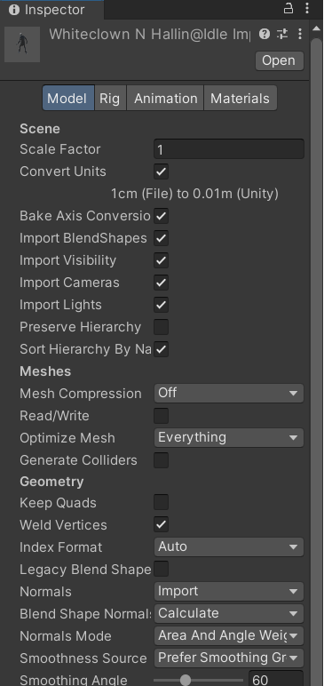
* Rig settings:
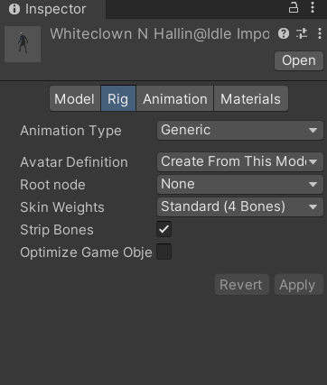
* Animation settings
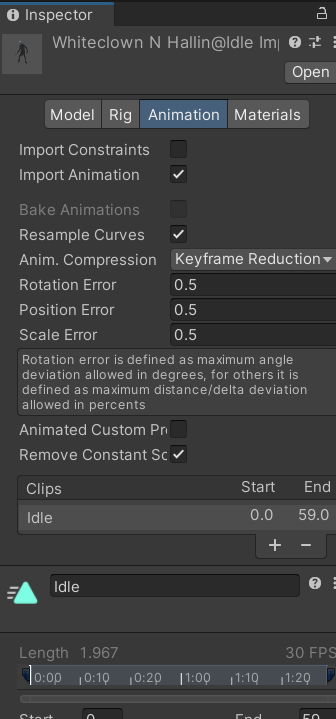
* Materials settings
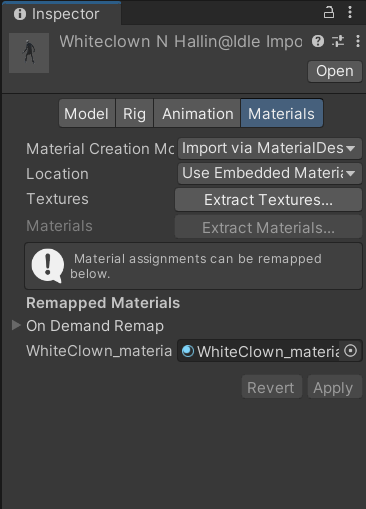
* Click op Extract Textures en Materials en sla deze op in je project

### 7. Sleep je fbx in de scene

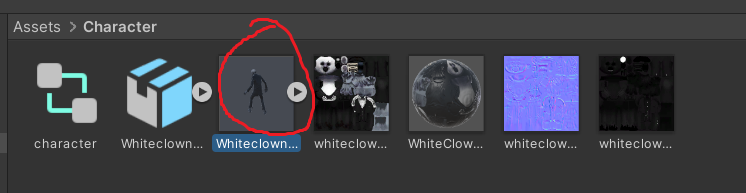

### 8. Voeg de animator controller toe
  
* Maak een Animator Controller aan 
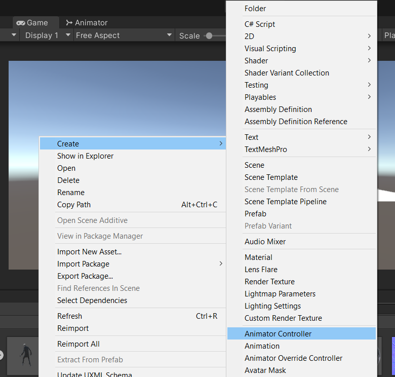
* Selecteer je character in de hierarchy

* Selecteer de nieuwe Animator Controller
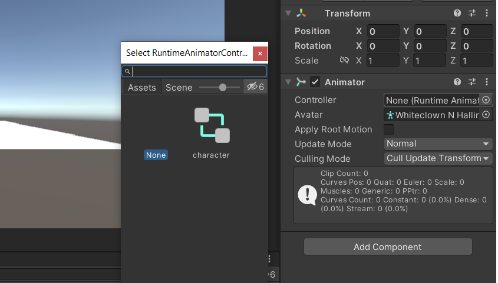
   
### 9. Plaats je animaties in de Animator

* Open het Animator Window
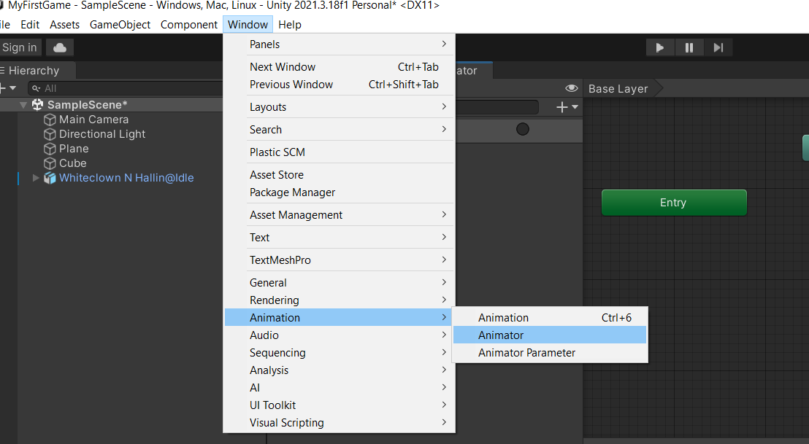
* Sleep je animaties in het animator window
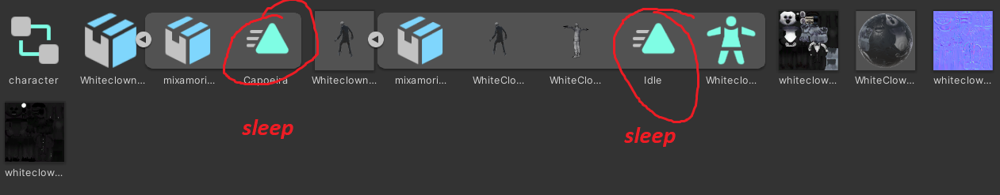
* Voeg een trigger toe
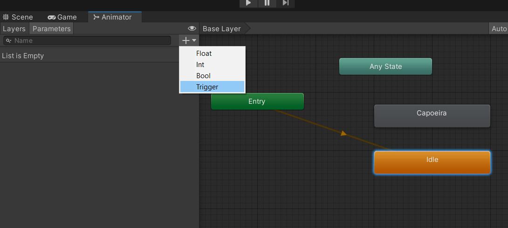
* voeg transitions toe 
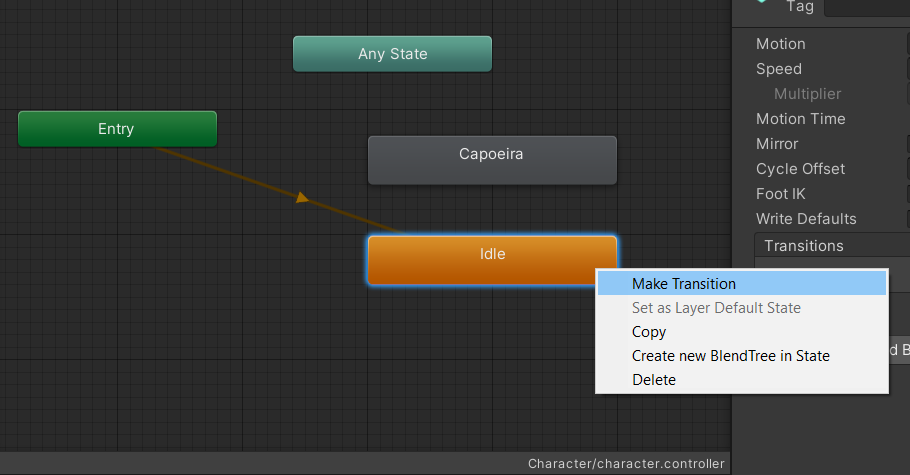
* zet als condition de trigger
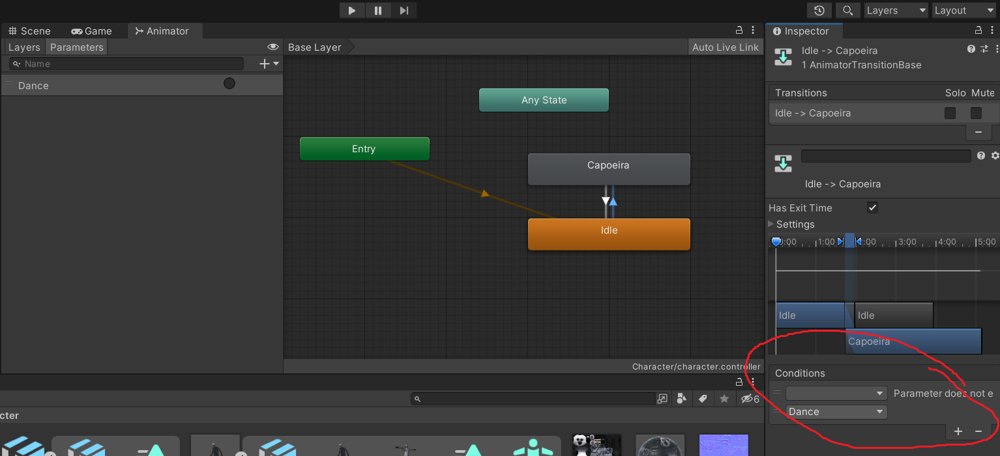

### 10. Maak code om de animatie aan te roepen
* Hang een nieuw script als component aan je character
* Gebruik de methode [Animator.SetTrigger("value")](https://docs.unity3d.com/ScriptReference/Animator.SetTrigger.html)

### 11. Zorg dat er standaard een idle animatie afspeelt en dat je character iets anders doet als je op een knop drukt.
     

### Commit en push je werk. Laat je Unity scene, je code en je repository zien aan de docent!
