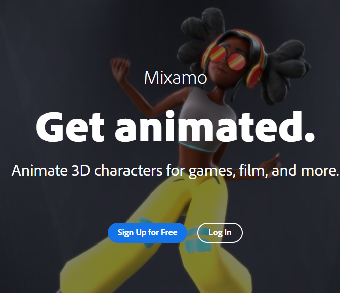
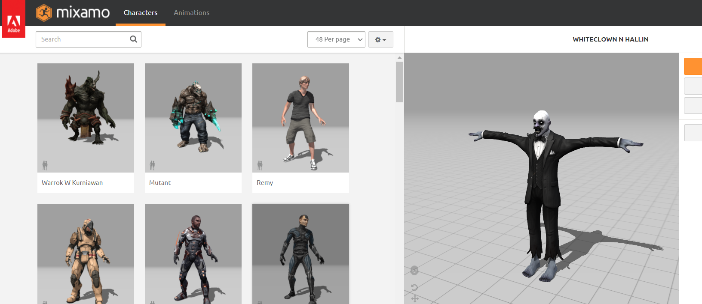

# SDM3PROG - Opdracht Les 2

**Les 2: animaties van mixamo implementeren en aansturen**

Voer de onderstaande stappen uit en laat voor het einde van de les zien hoe ver je bent gekomen.
Als je klaar bent laat je het ook zien.

Als je vast zit vraag je om hulp!

1. Ga naar Mixamo.com en maak een gratis account aan

* ***Optioneel*** [kun je deze tutorial volgen](https://youtu.be/8Pk7FI629O8)

2. Selecteer een character

3. Selecteer een animatie

4. Download primaire animatie (idle) met skin

5. Selecteer meer animaties en download deze zonder skin

6. zorg voor de juiste import settings in Unity
   * Model settings:
  

   * Rig settings:
   * Animation settings
   * Materials settings
   * Click op Extract Textures en Materials en sla deze op in je project

7. Sleep je fbx in de scene

18. Laat je Unity scene en je code zien aan de docent!