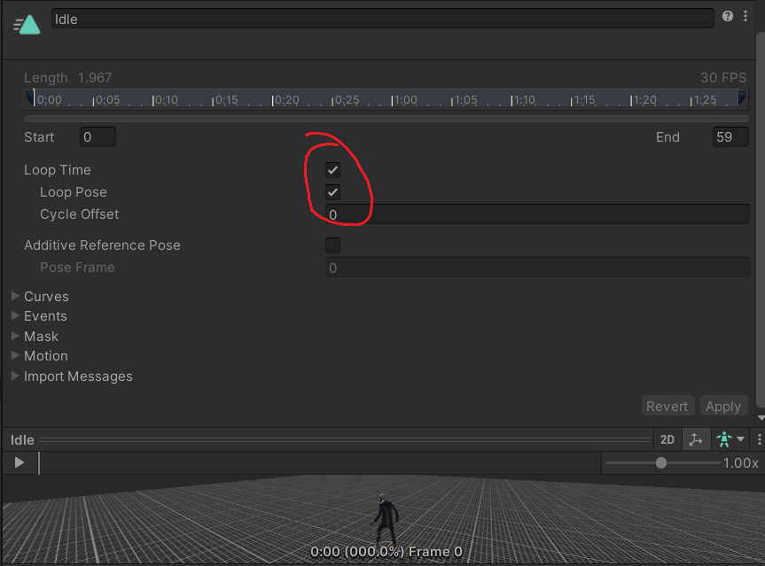
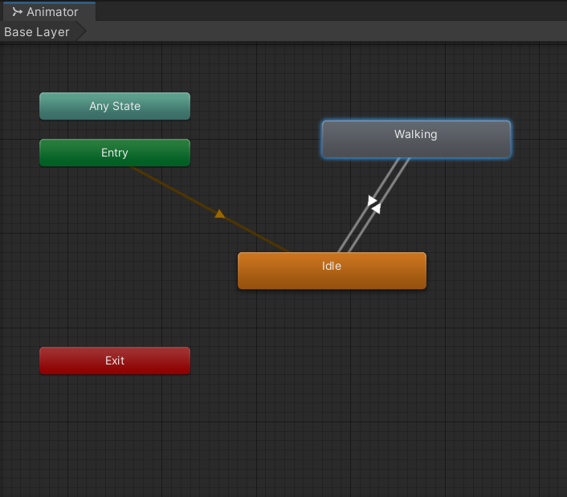
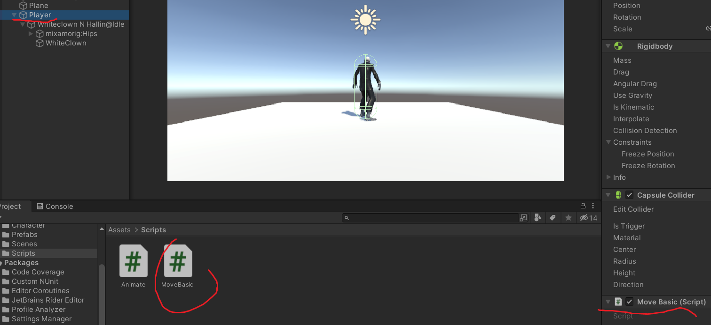

# SDM3PROG
**Les 3: Beweging en besturing van gameobjecten**

## Leerdoelen:
* Jullie begrijpen wat een [**Vector2** en **Vector3**](https://cgcookie.com/lessons/understanding-vector-3) is
* Jullie begrijpen wat een [**Rigidbody**](https://medium.com/eincode/unity-rigidbody-explained-fb208d0f97f3) is
* Jullie kunnen werken met de [**Velocity**](https://docs.unity3d.com/ScriptReference/Rigidbody-velocity.html) van een rigidbody
* Jullie kunnen objecten roteren met:[```transform.Rotate();```](https://docs.unity3d.com/ScriptReference/Transform.Rotate.html)
* Jullie kunnen waarden controleren met:[```Debug.Log();```](https://docs.unity3d.com/ScriptReference/Debug.Log.html)
* Jullie begrijpen waarom snelheden worden vermenigvuldigd met: [```Time.deltaTime```](https://docs.unity3d.com/ScriptReference/Time-deltaTime.html)
* Jullie kunnen variabelen in de inspector instelbaar maken met: [```[SerializeField]```](https://docs.unity3d.com/ScriptReference/SerializeField.html)
* Jullie kunnen met de Unity [**input manager**](https://docs.unity3d.com/Manual/class-InputManager.html) werken
* Jullie kunnen 3d modellen en animaties goed [importeren](https://docs.unity3d.com/Manual/class-FBXImporter.html) zodat deze goed worden afgespeeld
 
## Planning:
* **5 min.** Hoe ver is iedereen gekomen? handen omhoog.
* **20 min.** Uitleg over:
  * Vector2
  * Vector3
  * Rigidbody
  * Velocity
  * Rotation (transform.Rotate())
  * Debug.Log()
  * Time.deltaTime
  * [SerializeField]
  * Input Manager
* **5 min.** Demo blokje bewegen 
  * naar voren op de Z as
  * op zij op de X as
* **5 min.** Demo blokje bewegen
  * Naar voren via transform.forward
  * Roteren van de y as
* **60 min.** In 2 tallen werken aan de onderstaande opdracht
  * evt. wie wil klassiekaal de opdracht doornemen met de docent
* **15 min.** 3 groepjes laten zien hoe ver ze zijn gekomen en wat ze hebben gedaan
* **10 min.** Klassiekaal terugkijken: Wat ging goed en wat was/is lastig


## Opdracht:
Voer de onderstaande stappen uit en laat voor het einde van de les zien hoe ver je bent gekomen.

Als je klaar bent laat je het ook zien.

Als je vast zit vraag je om hulp!


### 1. Download via Mixamo een character met een "idle" en een "walk" of "run" animatie


### 2. Sla de animaties op in je "Character" folder

### 3. Check de settings van beide FBX objecten


**Exporteer zo nodig de materials en textures van je model**


**Zet "Loop Time" en "Loop Pose" aan voor je animaties**


### 4. Maak een vloer(plane) en een leeg game object voor je player

### 5. Sleep je "Idle" animatie incl. model in je lege Player gameobject

### 6. Voeg een animator component toe en een animator controller


### 7. Sleep je Idle animatie in de Animator tool


### 8. Sleep de Walk animatie in de Animator tool en maak transitions


### 9. Maak 3 triggers "Walk", "Idle" en "WalkR"
### 10. Voeg de juiste conditions toe aan je transitions
### 11. Zet voor je transitions "Has Exit Time" uit


### 12. dupliceer de walk animation in de animator en zet de Speed op -1


### 13. Voeg de transitions toe met de juiste triggers in de conditions


### 14. Voeg een rigidbody en een capsule collider toe aan de player


* Zorg dat de capsule collider de juiste maat en positie heeft
* Zet ze op je **Player** gameobject en niet op je model
* Zorg dat de capsule niet kan roteren op de x en z as zodat ie niet om kan vallen

### 15. Roteer je model 180 graden op de y as


### 16. Maak een Script met de naam Animate en plaats deze op je model


```
//Maak een variabele aan voor je animator component
private Animator ani;

void Start()
{
//Pak het animator component en sla die op in de variabele
    ani = GetComponent<Animator>();
}
void Update()
{
//Check voor verticale input
    if (Input.GetAxis("Vertical") > 0)
    {
//is de waarde groter dan 0 dan heb je een knop naar boven ingedrukt 
//Roep de juiste trigger aan!
        ani.SetTrigger("Walk"); 
//SetTrigger is trigger activeren
        ani.ResetTrigger("Idle"); 
        ani.ResetTrigger("WalkR");
//ResetTrigger is Trigger de-activeren
    }
    else if (Input.GetAxis("Vertical") < 0)
    {
//is de waarde kleiner dan 0 dan heb je een knop naar beneden ingedrukt
//Roep de juiste trigger aan
        ani.SetTrigger("WalkR");
        ani.ResetTrigger("Idle");
        ani.ResetTrigger("Walk");
    }
    else {
//is de waarde 0 dan heb je niets ingedrukt
//Roep de juiste trigger aan
        ani.SetTrigger("Idle");
        ani.ResetTrigger("Walk");
        ani.ResetTrigger("WalkR");
    }
}


```
### 17. Test of je animaties werken
* vooruit == Walk
* achteruit == WalkR
* niets == Idle


### 18. Maak nu een BasicMove script en zet deze op je player



### 19. Maak een variabele voor je beweeg snelheid en rotatie snelheid
```
public class MoveBasic : MonoBehaviour
{
//Maak 2 variabelen beschikbaar in de inspector
    [SerializeField]private float speed = 50f;
    [SerializeField]private float rotSpeed = 50f;
```

### 20. Maak een variabele voor je rigidbody

```
//Maak een variabele voor je rigidbody
    private Rigidbody rb;

```

### 21. Sla de rigidbody van je player op in de variabele met behulp van de methode [GetComponent<>()](https://docs.unity3d.com/ScriptReference/GameObject.GetComponent.html)

```
void Start()
{
    rb = gameObject.GetComponent<Rigidbody>();
}
```


### 22. Bereken de bewegingssnelheid van je player 

```
void Update()
{
//de input is tussen de -1 en de 1 maal de snelheid maal de frametijd
<<<<<<< HEAD
    float move = Time.deltaTime * speed * Input.GetAxis("Vertical");
=======
    float speed = Time.deltaTime * speed * Input.GetAxis("Vertical");
>>>>>>> dfaea3bead8100d1f5de7fee43f5da40dd871929
```
Check in de **Input Manager** (via edit > project settings) welke toetsen van invloed zijn op ***Input.GetAxis("vertical");***


### 23. Geef de snelheid door aan de velocity zodat je player gaat bewegen
```
<<<<<<< HEAD
    rb.velocity = rb.transform.forward * move;
=======
    rb.velocity = rb.transform.forward * speed;
>>>>>>> dfaea3bead8100d1f5de7fee43f5da40dd871929
```
### 24. Zorg ook voor de rotatie van je speler op basis van de input
```
    float rot = Input.GetAxis("Horizontal") * rotSpeed * Time.deltaTime;
    rb.transform.Rotate(new Vector3(0, rot, 0));        
}
```
### 25. Probeer de juiste snelheid voor het bewegen en roteren te vinden


### 26. Probeer zelf eens een script te schrijven om de een gameobject zonder te roteren over de X- en Z-as te bewegen 


### Commit en push je werk. Laat je Unity scene, je code en je repository zien aan de docent!
