# Tutorial 4
**Springen op platforms (& traps)**

## Leerdoelen:
* Jullie kunnen direct de **velocity** Vector manipuleren voor beweging
* Jullie kunnen functies gebruiken zoals [**AddForce()**](https://docs.unity3d.com/ScriptReference/Rigidbody.AddForce.html) wat de velocity  manipuleert
* Jullie kunnen in Unity een simpel platform level opzetten
* Jullie kunnen een speler object laten rondlopen
* Jullie kunnen een speler object laten springen
* Jullie kunnen je rigidbody passend instellen
* Jullie kunnen gameobjecten **parenten**
* Jullie kunnen **tags** maken en gebruiken
* Jullie kunnen **collisons** gebruiken in je script
 
## Planning:
* **5 min.** Hoe ver is iedereen gekomen? handen omhoog.
* **20 min.** Herhaling / uitleg over:
  * Vector3
  * Velocity
  * AddForce()
  * Parenting
  * Tags
  * Collision
  
* **60 min.** In 2 tallen werken aan de onderstaande opdracht
  * evt. wie wil klassiekaal de opdracht doornemen met de docent
* **15 min.** 3 groepjes laten zien hoe ver ze zijn gekomen en wat ze hebben gedaan
* **10 min.** Klassiekaal terugkijken: Wat ging goed en wat was/is lastig


## Opdracht:
Voer de onderstaande stappen uit en laat voor het einde van de les zien hoe ver je bent gekomen.

Als je klaar bent laat je het ook zien.

Als je vast zit vraag je om hulp!

### Jullie gaan deze les aan de gang om en simpele platformer te bouwen:


### 1. Maak een nieuwe scene aan: via file > new scene

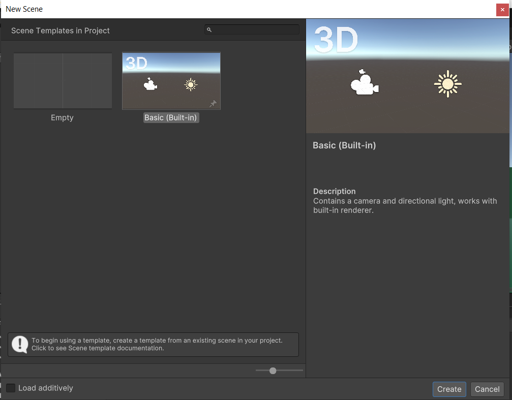

Kies de basic (built-in) scene


### 2. Maak een level

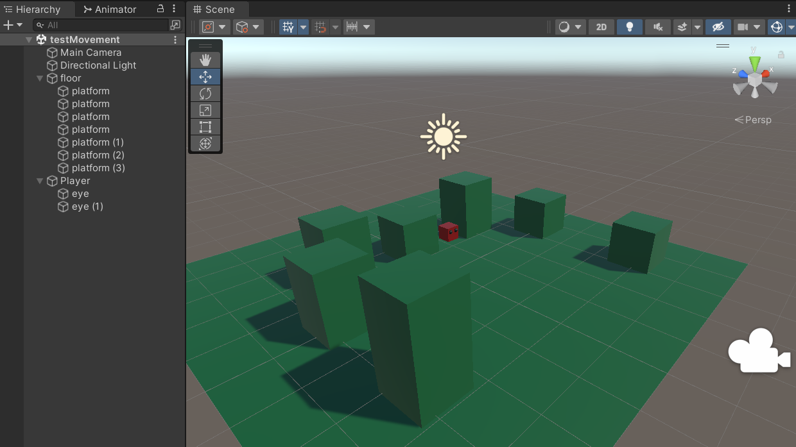

Het level bevat
* Een plane (vloer)
* Cubes (platforms)
* Nog een cube met spheres erin (player met oogjes)

Door de spheres in de cube te slepen in de hierarchy worden ze onderdeel van de cube. Dit heet parenting.
Ook mijn platforms zijn onderdeel van mijn floor oftewel mijn level.


### 3. Geef je gameobjecten een kleur met eigen materials

* Maak een folder aan voor je Materials

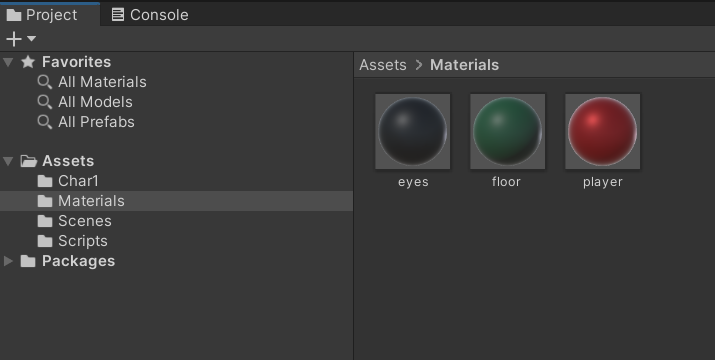

* Click rechts en selecteer **create > Material**

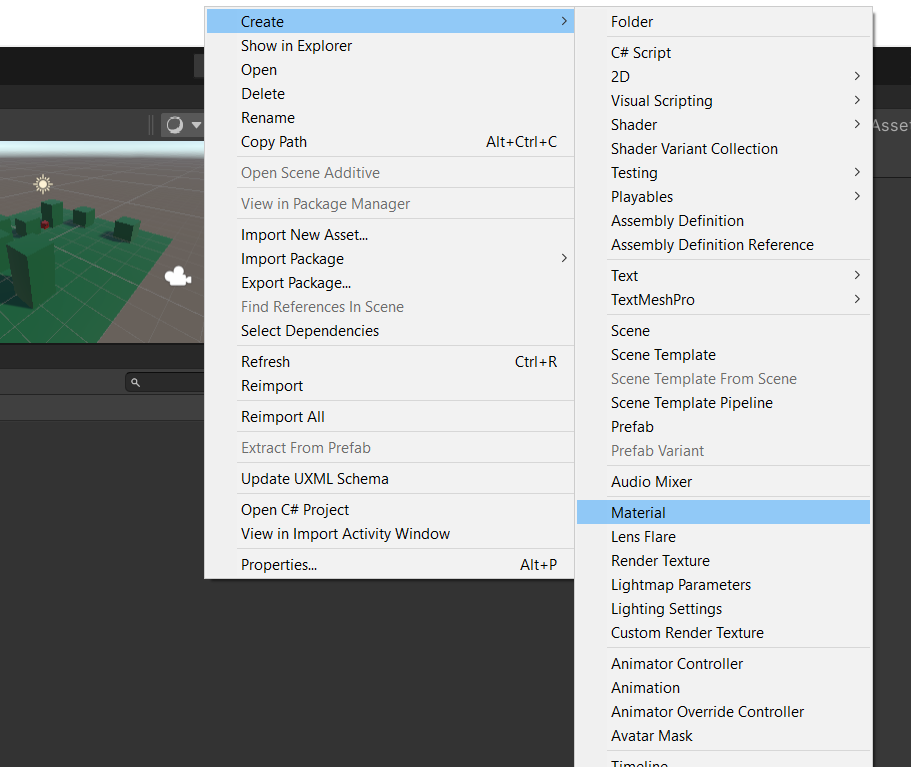

* Geef je materials een naam

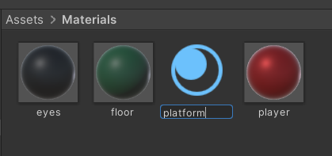

* Geef je materials een kleur

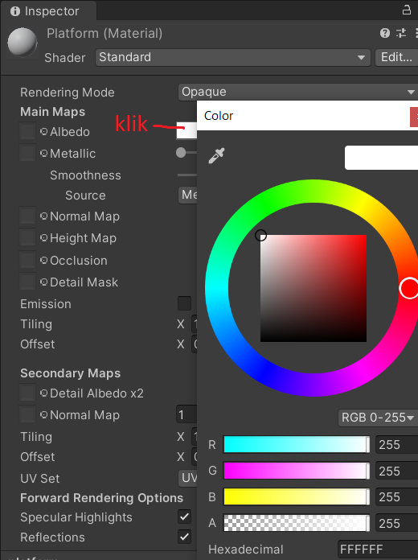

* Sleep de materials op je gameobjecten

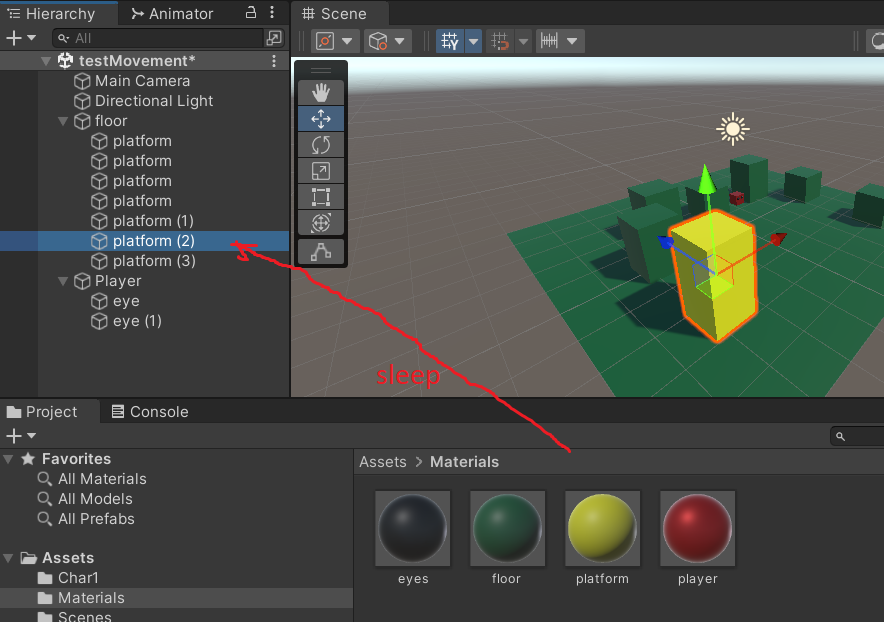


### 4. Zorg dat de Player dit niet kan doen !

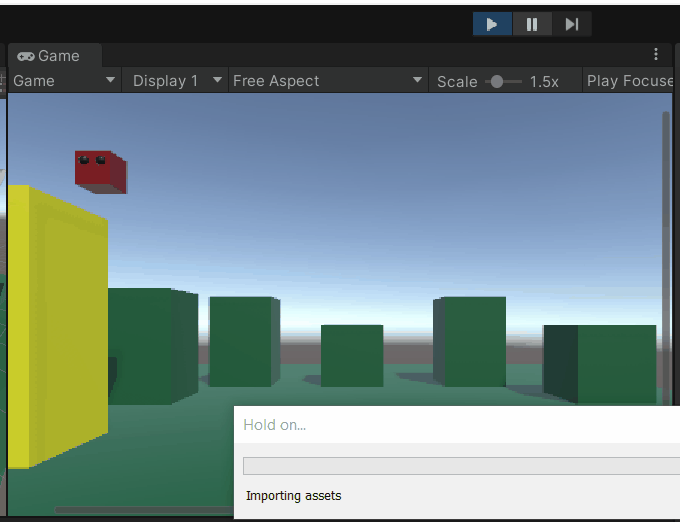

Maar dat hij Op het platform blijft staan tot hij volledig over de rand gaat.

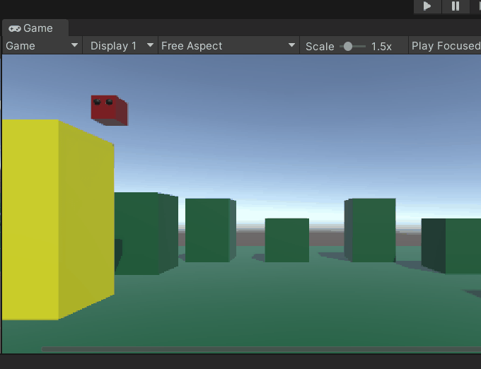

***Hint: check je Rigidbody*** 

### 5. Laat je Cube (speler) rondlopen

**Zie les 3 ;)**

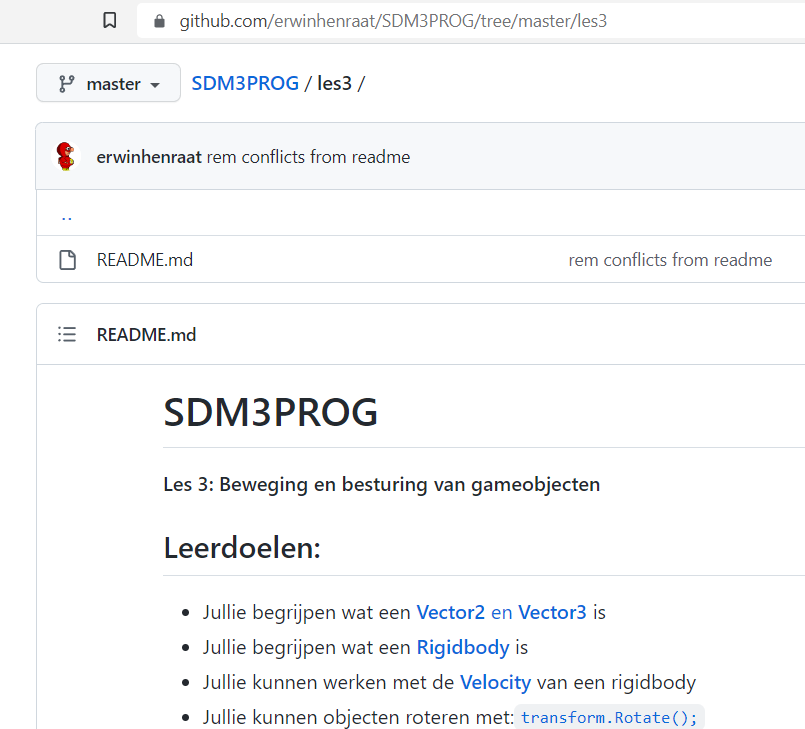

### 6. Laat je Cube springen
* Maak een nieuw Jump.cs script aan
* Sleep deze op je Cube (player)
* Open het script in je code editor

* Zorg voor een *private* variabele (bijv. **rb**) waarin je je **Rigidbody** opslaat in de **void Start()** Method

* Zorg dat je in de **void Update()** checkt of de [**spatiebalk** is ingedrukt](https://docs.unity3d.com/ScriptReference/Input.GetKeyDown.html)

* Zorg voor een *public* variabele **force** die bepaalt hoe hard/hoog je kunt springen geef deze een **default** waarde van **20f** 
```
public float force = 20f;
```
* Gebruik de [**AddForce() method**](https://gamedevbeginner.com/how-to-jump-in-unity-with-or-without-physics/#jump_unity) om de speler te laten springen.


### 7. Laat je Cube goed en *bugvrij* springen

**Mogelijk werkt deze nu heel erg crappy!**

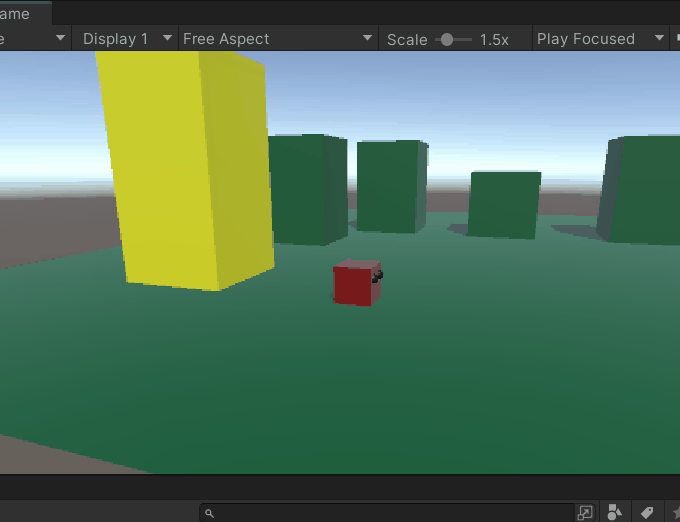

**Schakel dan eens je **Move** script uit!**

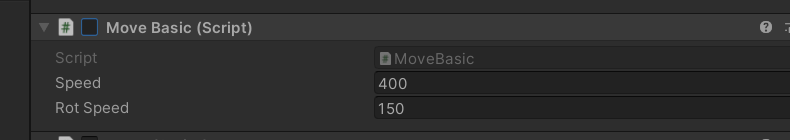

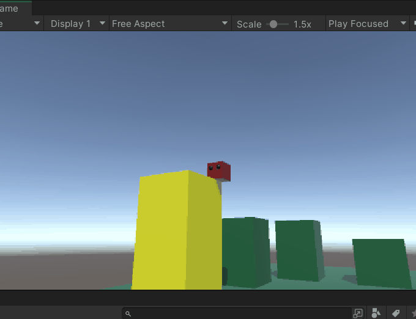

**Gefeliciteerd! Je hebt een:** 
Dit betekent dat je code werkt en geen fouten heeft of errors geeft alleen niet doet wat je verwacht en wilt!

**Dit is de boosdoener:**
``` 
    void Update()
    {
        rb.velocity = rb.transform.forward * move;
    }
```
Elke keer wanneer er in je **Jump.cs** script **AddForce()** wordt aangeroepen past deze je velocity aan.
Echter wordt deze velocity door je Move script steeds weer overschreven waardoorde waarde van je velocity op de y as weer **0** wordt
Hierdoor wordt de sprong gecanceled!

**Dit is *een* oplossing:**
```
    //rb.velocity = rb.transform.forward * move;
    Vector3 lastVel = rb.velocity;
    Vector3 newVel = rb.transform.forward * move;
    newVel.y = lastVel.y;
    rb.velocity = newVel;
```
Begrijp je wat er nu gebeurt??!

**Nog een Bug!**

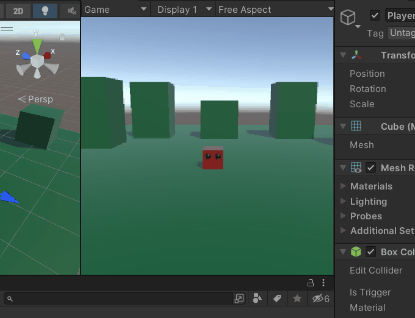

Of eigenlijk heb je nog niet geprogrammeerd dat je maar 1x mag springen totdat je weer bent geland.

* Maak een variabele aan die bijhoudt of je op de grond staat of niet (*welk datatype is hier handig voor? wel of niet op de grond!*) 
* Zet de waarde op **False** aan het begin van je script
* Zet de waarde op **False** op het moment dat je springt en dus de **AddForce()** methode aanroept
* Gebruik de **void OnCollisionEnter()** Methode om te checken of je op de grond staat:

```
private void OnCollisionEnter(Collision collision)
{
    if (collision.gameObject.tag == "floor") {
        onFloor = true;        
    }
}
```
* Zorg er voor in je **Jump** script dat je alleen kan springen als **onFloor** de waarde **True** Heeft.
```
    if (Input.GetKeyDown(KeyCode.Space) && onFloor == True)
```
<a name="tag">..</a>
* Maak nu in Unity een nieuwe **Tag** aan: **"floor"**

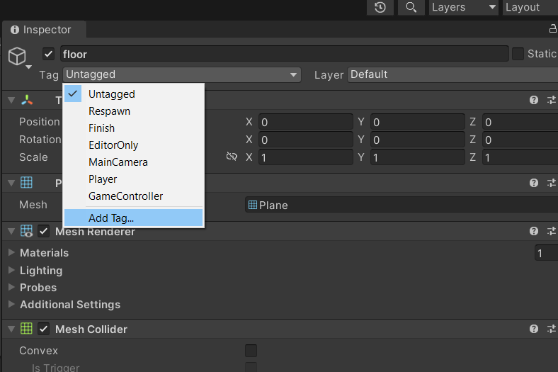

* Geef nu je vloer en al je platforms deze nieuwe tag

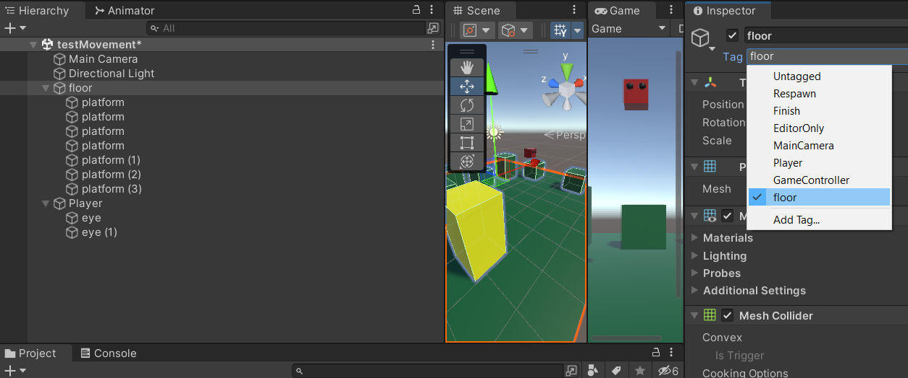

* Test je Game!

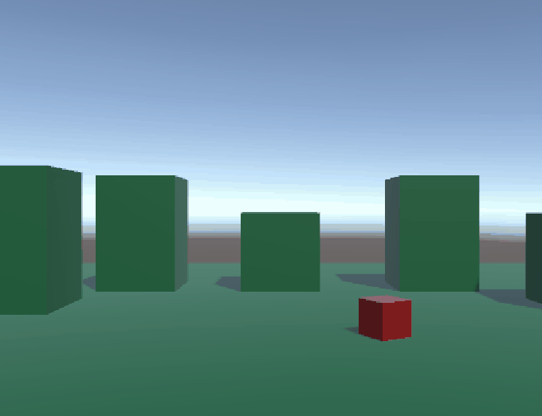

### Commit en push je werk. Laat je Unity scene, je code en je repository zien aan de docent!

### 8. Bonus: Fix de camera
Kun jij zelf uitvogelen hoe je de camera de speler kan laten volgen zoals in mijn voorbeelden?

### 9. Bonus: Maak een exploding trap

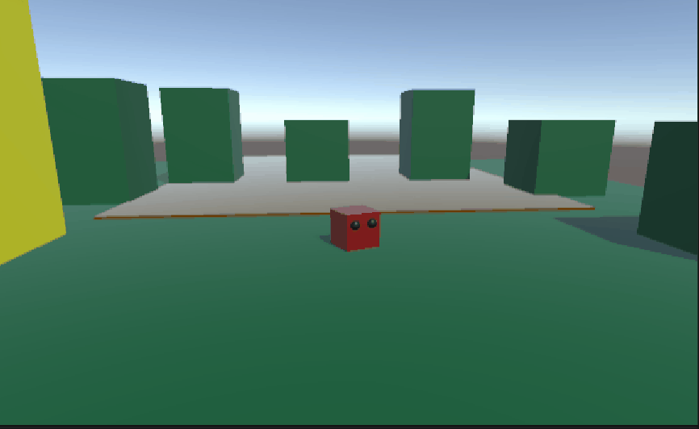

* Maak een Cube en noem hem **"trap"**

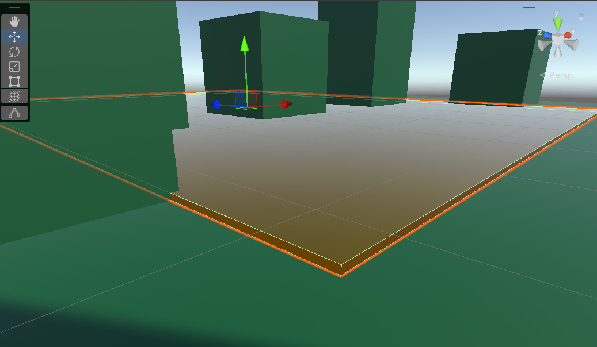

* Voor een mooi explosie effect kun je [deze video](https://www.youtube.com/watch?v=cvQiQglPI18) bekijken

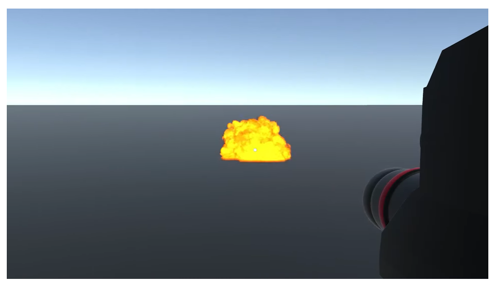

* Hang een nieuw script aan je **Trap** noem het **"TrapTrigger"**

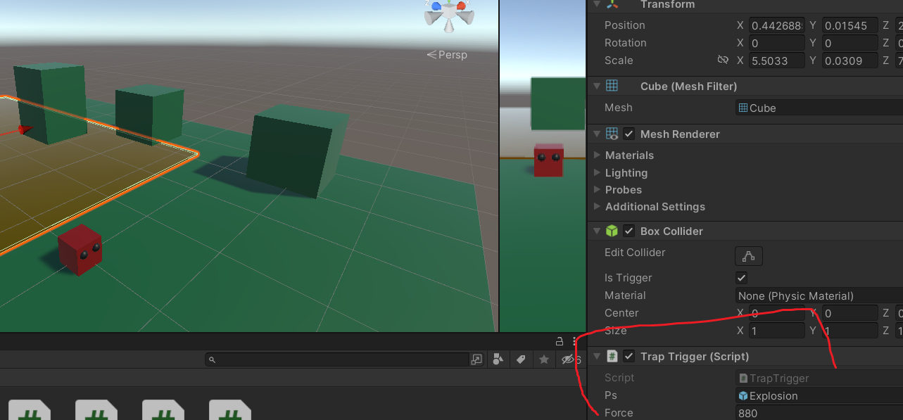


* Maak de noodzakelijke variabelen 

```
    public GameObject ps;
    public float force = 200f;
```

**ps** staat voor particle system daarmee kun je de particles inladen en aansturen
**force** is voor de kracht waarmee je speler wordt weggeslingerd

<a name="prefab">...</a>
* Sleep je **explosion** prefab in je **ps** variabele

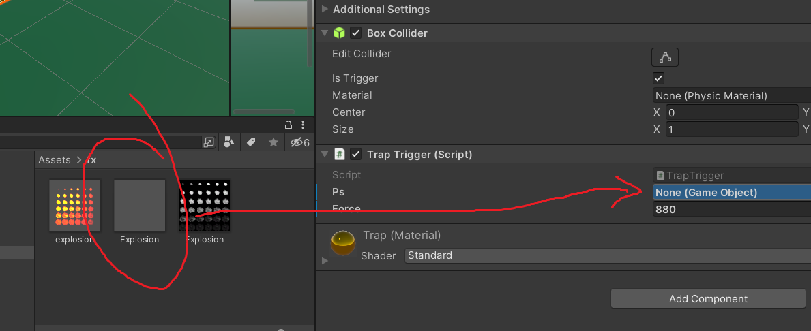


* Zet de tag voor de speler op **"Player"**

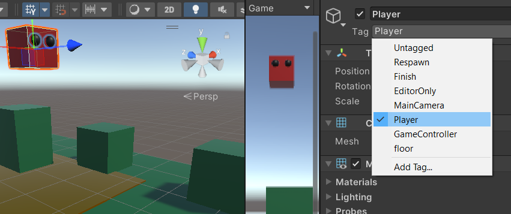

* Maak van de **collider** van je **trap** een **trigger** 

Kun je bedenken wat het verschil is tussen een **collider** en een **trigger**?

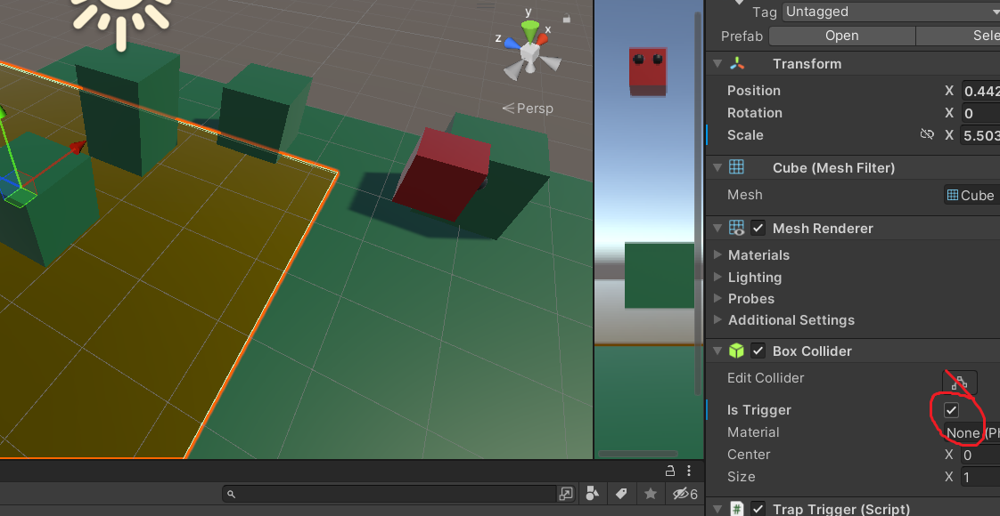


* Voeg de **OnTriggerEnter()** methode toe aan je script
```
private void OnTriggerEnter(Collider other)
{

}
```

Deze wordt automatisch aangeroepen als iets de **"trigger"** van je **trap** raakt

* Check wie de trap heeft geraakt door de tag te controleren

```
    if (other.gameObject.tag == "Player"){
    
    }
```

* Als de trigger door de player wordt geraakt moet de speler worden gelanceerd! Gebruik hiervoor de methode [**AddExplosionForce()**](https://docs.unity3d.com/ScriptReference/Rigidbody.AddExplosionForce.html)
* Daarnaast moeten de controls worden uitgezet zodat je de speler niet meer kan bewegen. Om een ander script te vinden gebruik je de methode **GetComponentInChildren<>()**
```
    if (other.gameObject.tag == "Player"){
         //Lanceer
         Rigidbody rb = other.GetComponent<Rigidbody>();
         Transform t = other.transform;
         rb.AddExplosionForce(force, new Vector3(t.position.x,t.position.y,t.position.z), 0f);
         //Controls uit
         MoveBasic mbScript = other.GetComponentInChildren<MoveBasic>();
         mbScript.enabled = false;
    
    }
```

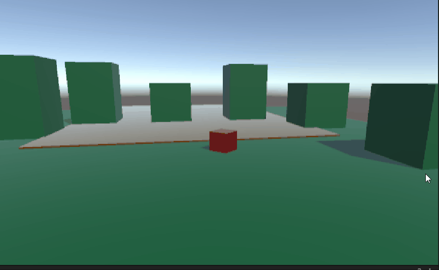


De explosie vindt plaats midden in je **Player** waardoor je de lucht in vliegt. 

* Verplaats de positie van de explosie ten opzichte van je **Player** en bekijk het effect

```
    rb.AddExplosionForce(force, new Vector3(t.position.x,t.position.y,t.position.z + 1f), 0f);
```

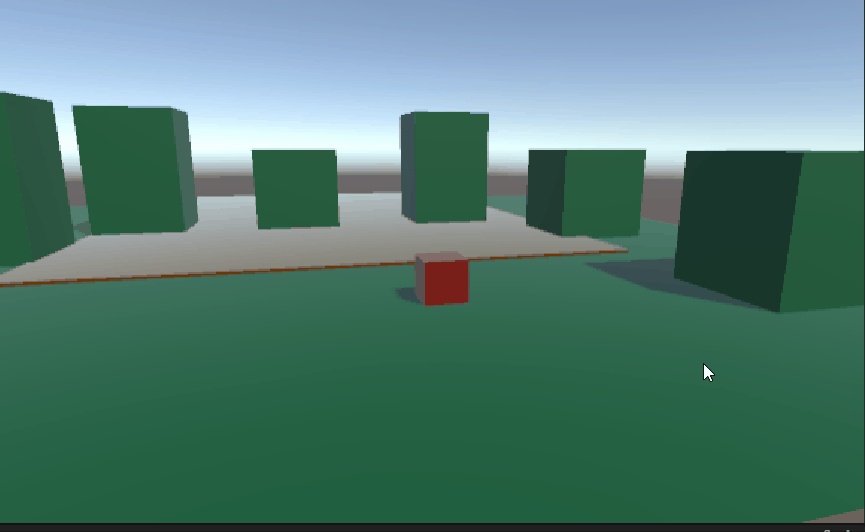

* Zorg dat je Player tijdens de explosie alle kanten op kan draaien

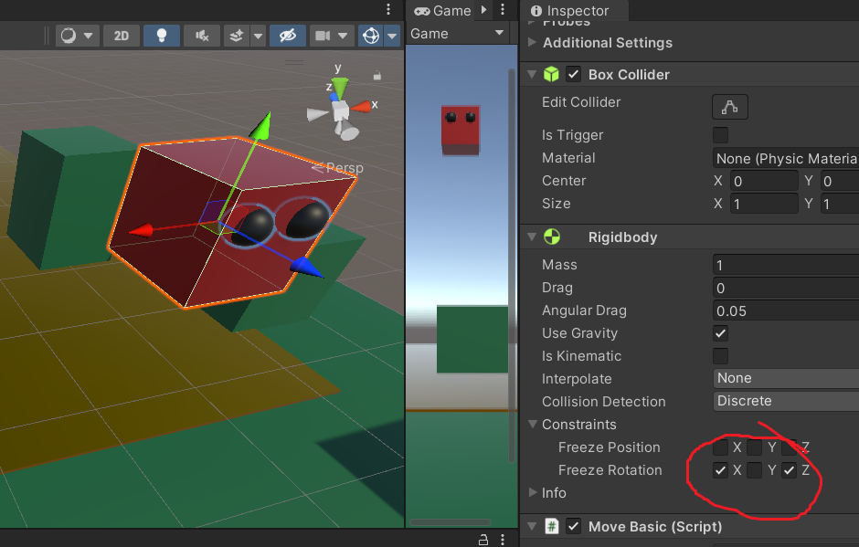

Om dit te doen moeten de constraints van je rigidbody uitgezet worden vlak voor de explosie

```
    rb.constraints = RigidbodyConstraints.None;
```

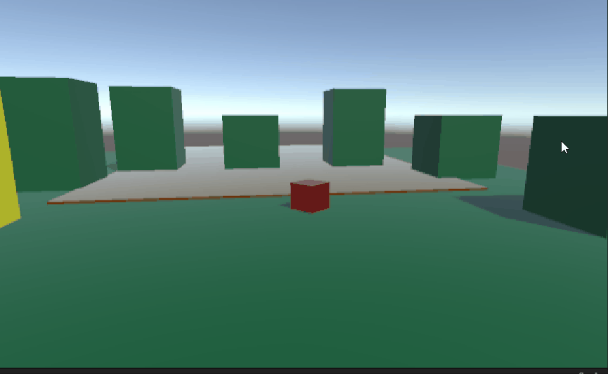

* Zorg dat de player ook omhoog en naar achteren gaat

* Nu is het tijd om je particle system te implementeren voor een echte explosie

Iets op het scherm zetten wat er nog niet is noemen we **"instantieren"** hiervoor gebruik je de Methode [**Instantiate()**](https://docs.unity3d.com/ScriptReference/Object.Instantiate.html)

* instatieer het **particle system** dat je als prefab aan de variabele **ps** <a href="#prefab">hebt gehangen</a>.

```
    GameObject p = Instantiate(ps, transform);    
```

* plaats het **particle system** op de juiste plek (positie van de speler)

```
    p.transform.position = t.position;
```
* verwijder het **particle system** na een seconde

```
    Destroy(p,1);
```

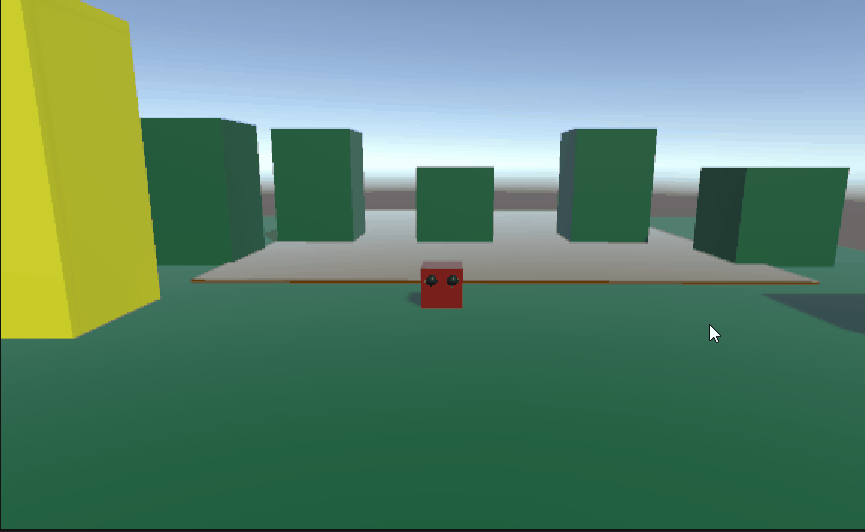

Voila!
