# SDM3PROG
**Les 5: Verzamelen van pickups en score bijhouden**

## Leerdoelen:
* De student kan een prefab maken en hergebruiken in een scene
* De student begrijpt het verschil tussen colliders en triggers en kan voor beiden in een script controleren of ze worden geraakt
* De student kan een canvas plaatsen en hiermee een simpele werkende UI (scorebord) maken
* De student begrijpt wat een renderer doet en kan deze via script benaderen
* De student kan een simpel particle system opzetten en aansturen vanuit het script
* De student kan audio toevoegen en aansturen vanuit het script
* De student kan scripts code van elkaar aan laten roepen met **public Methods**  
 
## Planning:
* **5 min.** Hoe ver is iedereen gekomen? handen omhoog.
* **20 min.** Herhaling / uitleg over:
  * prefabs
  * triggers vs colliders
  * canvas
  * renderer
  * particle system
  * audioSource & audioClips
  * public method
 
* **60 min.** In 2 tallen werken aan de onderstaande opdracht
  * evt. wie wil klassiekaal de opdracht doornemen met de docent
* **15 min.** 3 groepjes laten zien hoe ver ze zijn gekomen en wat ze hebben gedaan
* **10 min.** Klassiekaal terugkijken: Wat ging goed en wat was/is lastig


## Opdracht:
Voer de onderstaande stappen uit en laat voor het einde van de les zien hoe ver je bent gekomen.

Als je klaar bent laat je het ook zien.

Als je vast zit vraag je om hulp!

### Jullie gaan deze les pickups toevoegen aan je platformer en een scoreboard bijhouden:


### Maak je pickup object

* bijvoorbeeld een sphere

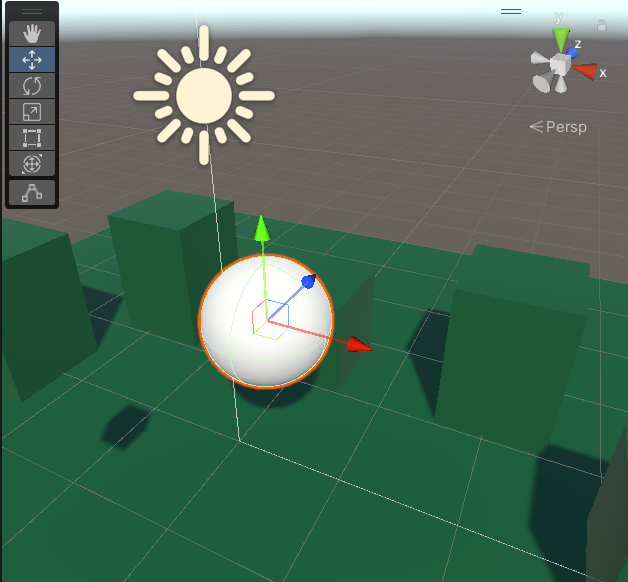

* Maak een **"prefab"** map aan
* Sleep de sphere in de map

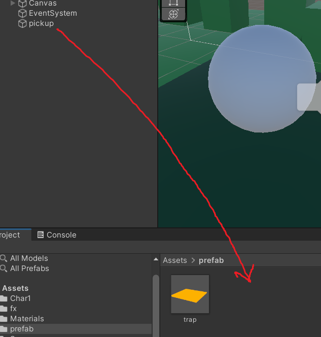

* Verwijder de pickup uit je hierarchy en open de prefab vanuit je project window

* Maak een trigger van de collider op je pickup

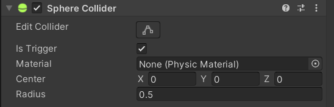

### Importeer audio voor je pickup

* Maak of zoek een leuk geluids effect

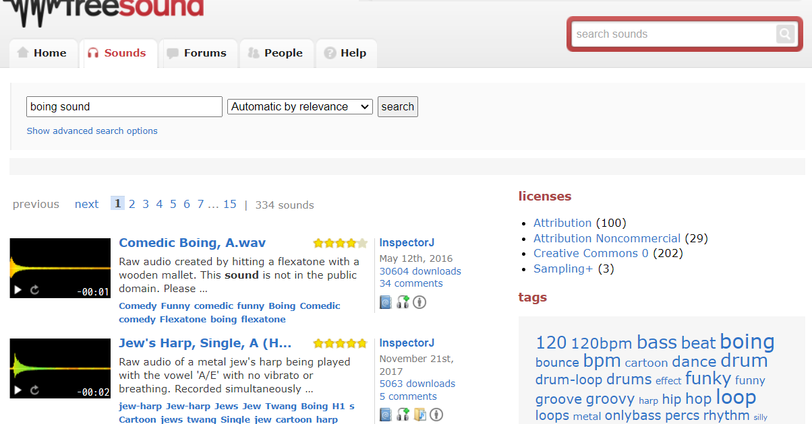

* Sleep je geluid in de FX map

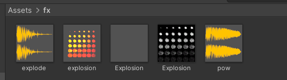

* Voeg een **"audioSource"** component toe aan je **pickup**
* Sleep je **soundFile** in het **"audioClip"** veld

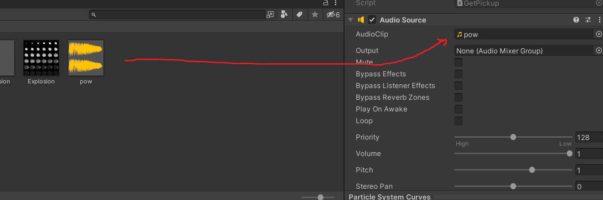

### Voeg een ParticleSystem toe en maak er wat moois van

* Probeer eerst eens wat aan te klooien
* Neem zonodig door wat je met de verschillende [particle modules](https://docs.unity3d.com/Manual/ParticleSystemModules.html) kunt
* Of [zoek een korte tutorial](https://letmegooglethat.com/?q=simple+unity+particle+effect+tutorial)

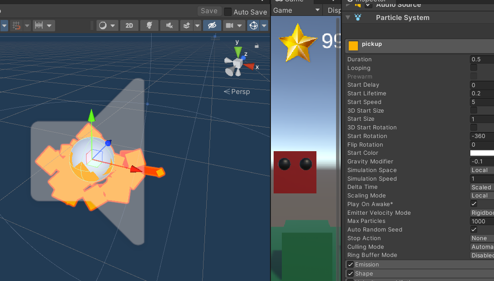

* Zorg dat Looping uitstaat
* Zet je Emission op 0
* Voeg een burst toe

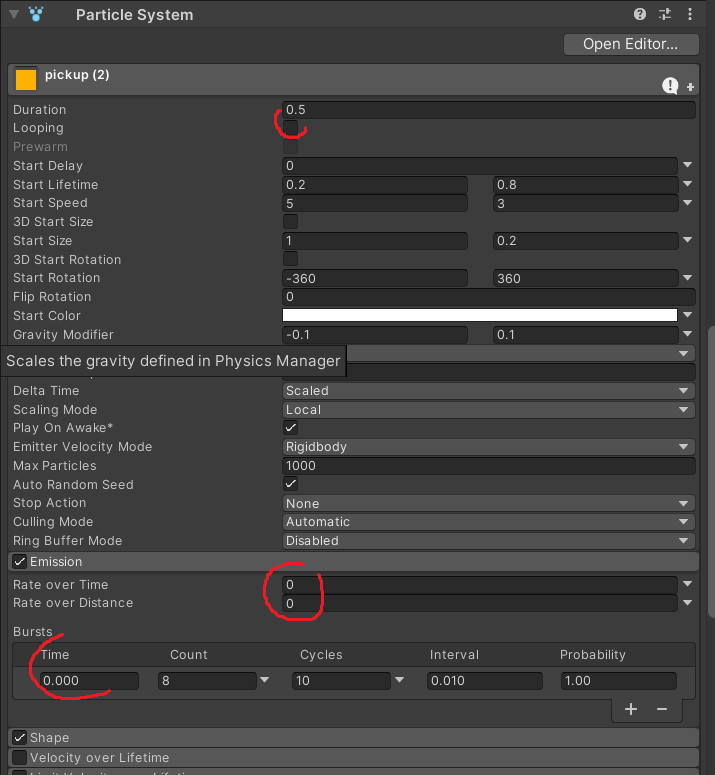


### Plaats je pickups in je level

* Sleep de prefab in je level
* Zet ze op de juiste plek

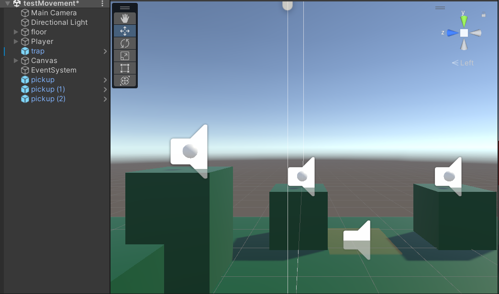

### Programmeer je pickup

* Maak een nieuw script voor je pickup **"GetPickup"**
* Hang deze aan je gameobject

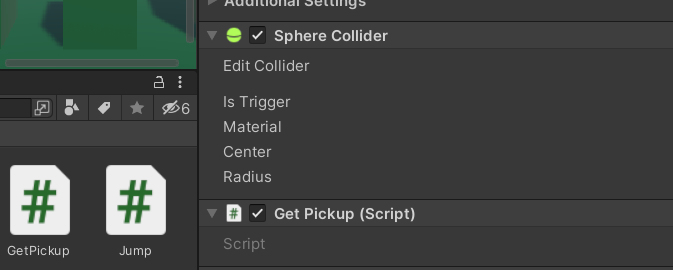

* Gebruik de [**OnTriggerEnter()**](https://docs.unity3d.com/ScriptReference/Collider.OnTriggerEnter.html) methode om te checken of de speler de pickup raakt
* Check via de Tag of de "Player" de pickup raakt

```
private void OnTriggerEnter(Collider other)
{
    if (other.tag == "Player") {
        
    }
}
```

* Haal de pickup een halve seconde nadat hij geraakt wordt weg met de [**Destroy()**](https://docs.unity3d.com/ScriptReference/Object.Destroy.html) methode
```
    GameObject.Destroy(gameObject, 0.5f);
```

* Zorg dat de renderer stopt als je de pickup raakt (zodat je pickup gelijk lijkt te verdwijnen i.p.v na een halve seconde)

```
void Start()
{
    r = GetComponent<Renderer>();
}
void OnTriggerEnter(Collider other)
{
    if (other.tag == "Player") {
        r.enabled = false;
        GameObject.Destroy(gameObject, 0.5f);
    }
}
```

* Zorg voor een variabele voor je **audioSource**

```
    private AudioSource source; 
```

* Zet het **audioSource** component in je variabele

```
    source = GetComponent<AudioSource>();
```

* Speel de **audioSource** af als je de pickup raakt

```
    source.Play();
```

* Maak een variabele voor je **particleSystem**

```
private ParticleSystem ps;
```

* Zet je **particleSystem** component in de variabele

```
    ps = GetComponent<ParticleSystem>();
```

* Zet je **particleSystem** uit als de game start

```
    ps.Stop();
```

* Zet je **particleSystem** aan als de speler de pickup raakt

```
    ps.Play();
```

### Maak een score systeem en scoreboard

* Maak een Canvas aan in je hierarchy

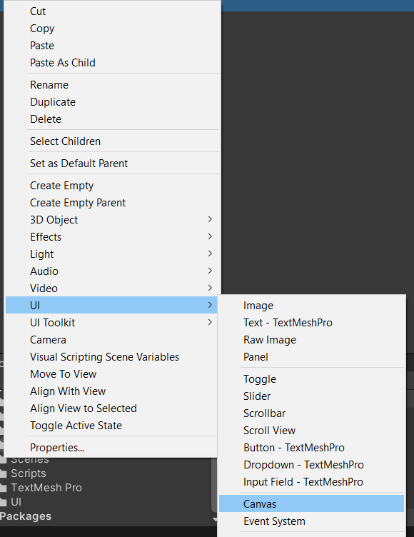

* Voeg in de canvas een leeg gameObject toe, noem het **"Header"**
* Zet in dit game object een **HorizontalLayoutGroup** component

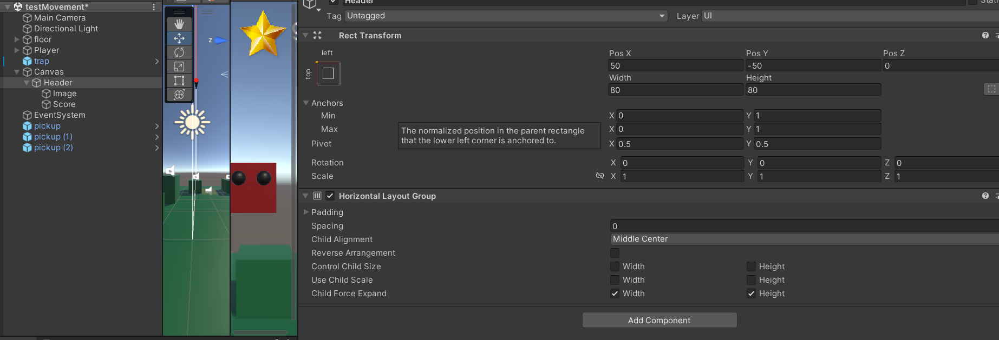

* Voeg 2 lege gameobjecten toe in je **Header**:

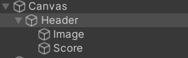

* **Image**, voeg hieraan een **Image** component toe

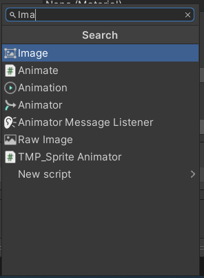

* **Score**, voeg hieraan een **TextMeshPro - Text (UI)** component toe

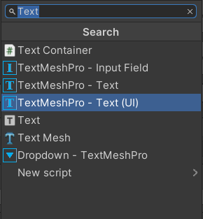

* Importeer een plaatje en stel deze in als **Sprite**

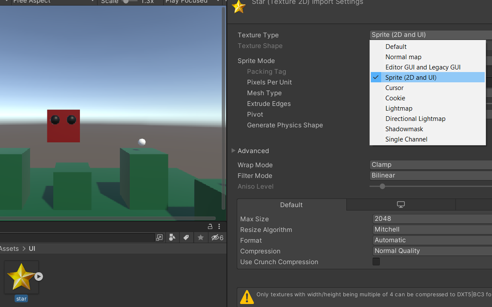

* Voeg de Sprite toe aan het **sourceImage** veld van je **Image** component op je **"Image"** gameobject 

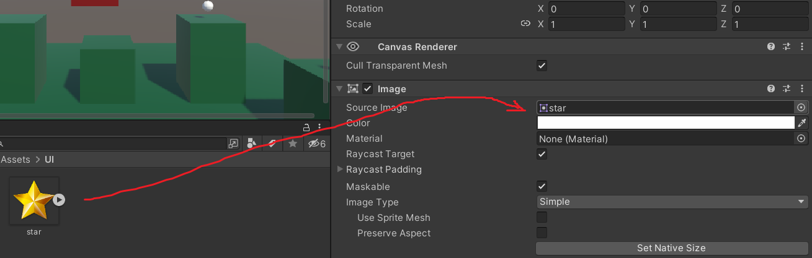

* Zet een willekeurig getal in het **TextInput** veld van je **TextMeshPro - Text (UI)** component in je **"Score"** gameObject

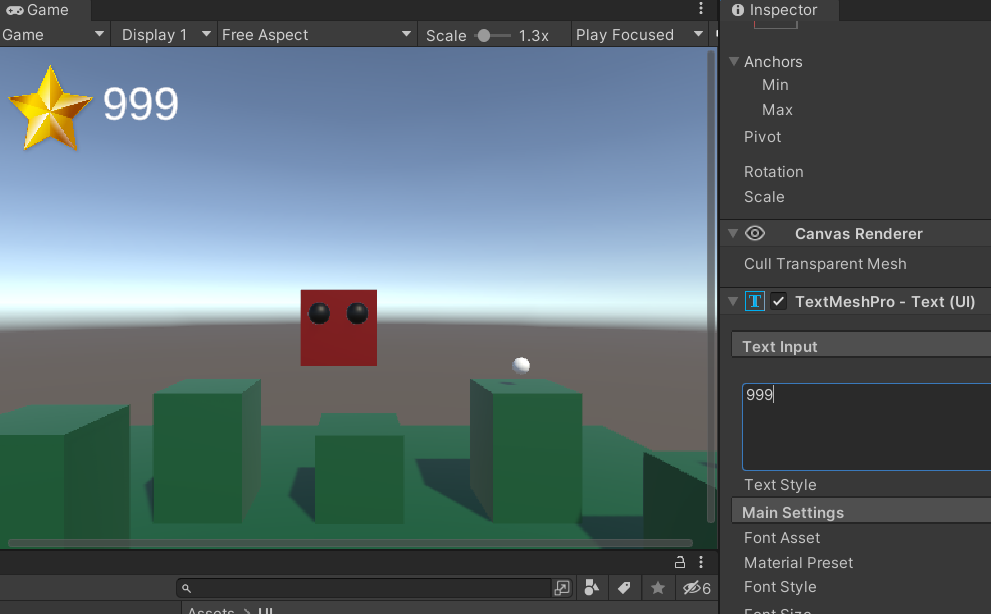

* Maak een script voor je score systeem : **"KeepScore"**
* Hang dit script aan je **Score** gameObject

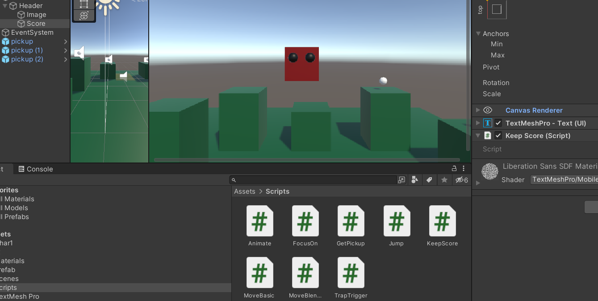

* Maak een variabele waarin je het textveld kunt opslaan, van het type **TMP_Text** 

```
    private TMP_Text scoreField;
```

* Maak een variabele waarin je je **score** kunt opslaan

```
    private int score = 0;
```

* Zorg dat je je textveld opslaat als de game start

```
    scoreField = GetComponent<TMP_Text>();
```

* Zet je **score** op 0 als de game start

```
    score = 0;
    scoreField.text = "" + score;
```

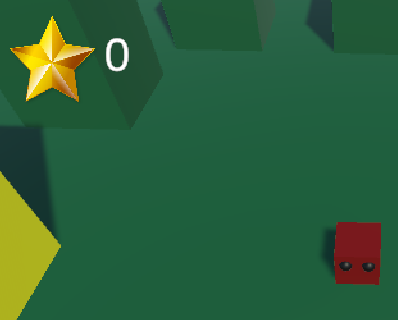

* Maak nu een eigen **Methode** waarme je vanuit een ander script **score** kunt **toevoegen**  

```
    public void AddScore(int add) {
        score += add;       
        scoreField.text = "" + score;
    }
```

* Open je **GetPickup** Script
* Maak een variabele waarin je het **KeepScore** script kunt opslaan

```
    private KeepScore scoreScript;
```

* Zoek als het spel start naar het **KeepScore** script met de methode [**FindAnyObjectByType()**](https://docs.unity3d.com/ScriptReference/Object.FindAnyObjectByType.html)

```
    scoreScript = FindAnyObjectByType<KeepScore>();
```

* Als de speler een **pickup** raakt roep dan de **AddScore()** methode aan

```
    scoreScript.AddScore(5);
```

* Test je game!


### Commit en push je werk. Laat je Unity scene, je code en je repository zien aan de docent!