# SDM3PROG
**Les 6: Schieten en obstakels kapot maken**

## Leerdoelen:
* De student een prefab Instantireen vanuit een script
* De student kan met Destroy() iets verwijderen na een bepaalde tijd
* De student kan eigenschappen zoals positie en rotatie van een object overnemen naar een ander object
* De student kan een object, zoals een particle effect, inladen, afspelen en verwijderen
* De student kan met **OnTriggerEnter()** een actie uitvoeren nadat 2 objecten elkaar raken
* De student krijgt een introductie in het hergebruiken van scripts

## Planning:
* **5 min.** Hoe ver is iedereen gekomen? handen omhoog.
* **20 min.** Herhaling / uitleg over:
  * Instantiate
  * Destroy()
  * OnTriggerEnter()
  * Collider ipv Collision
  * Hergebruik script voorbeeld (KillOnHit.cs op enemy en bullet prefabs) 
 
* **60 min.** In 2 tallen werken aan de onderstaande opdracht
  * evt. wie wil klassiekaal de opdracht doornemen met de docent
* **15 min.** 3 groepjes laten zien hoe ver ze zijn gekomen en wat ze hebben gedaan
* **10 min.** Klassiekaal terugkijken: Wat ging goed en wat was/is lastig


## Opdracht:
Voer de onderstaande stappen uit en laat voor het einde van de les zien hoe ver je bent gekomen.

Als je klaar bent laat je het ook zien.

Als je vast zit vraag je om hulp!

### Jullie gaan deze les kogels en vijanden maken:

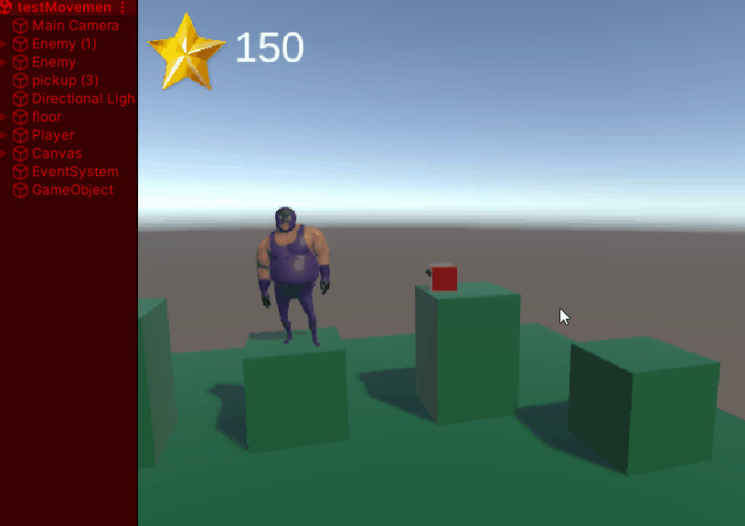

### Maak een prefab voor je vijand

* Gebruik hiervoor een geanimeerd mixamo character naar keuze **[(zie les 2)](../les2/README.md)**

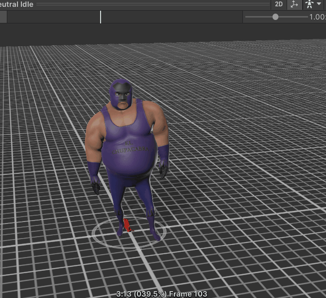

* Plaats de enemy prefab in de map prefabs

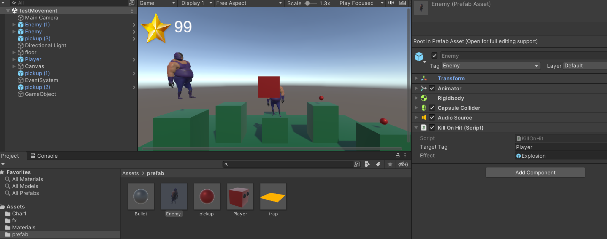

* Zorg voor een animator component met een animation controller etc...
* Zorg voor een Rigidbody component en een capsule collider op de juiste plek en van de juiste grootte
* Voeg een audio source component toe met een explosie geluidje
* Geef je enemy de tag "Enemy" [(check les 4)](../les4/README.md#tag)

### Maak een prefab voor je kogel

* Gebruik hiervoor een sphere met een mooie material erop
* Plaats de bullet prefab in de map prefabs


* Zorg voor een leuk particle system om je bullet wat vuur te geven

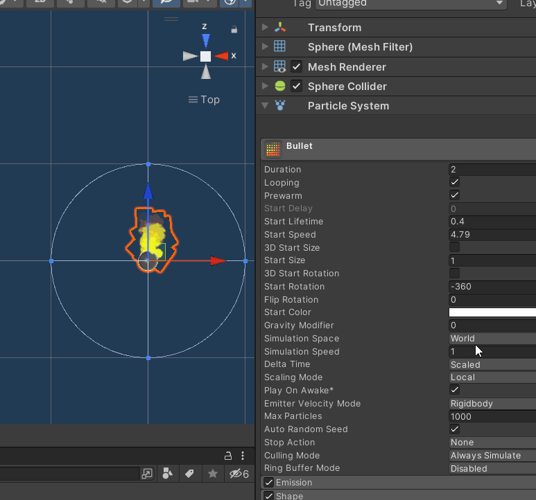

*Tip: hergebruik je [explosion particle system](../les4/README.md#9.-Bonus:-Maak-een-exploding-trap) als je die hebt gemaakt.*

* Zorg voor een Rigidbody component
* Zorg voor een Audio Source component met een explosie geluidje 

### Tijd om te scripten: **Shoot.cs**

* Maak een **Shoot.cs** script aan 
* Hang het script op je player

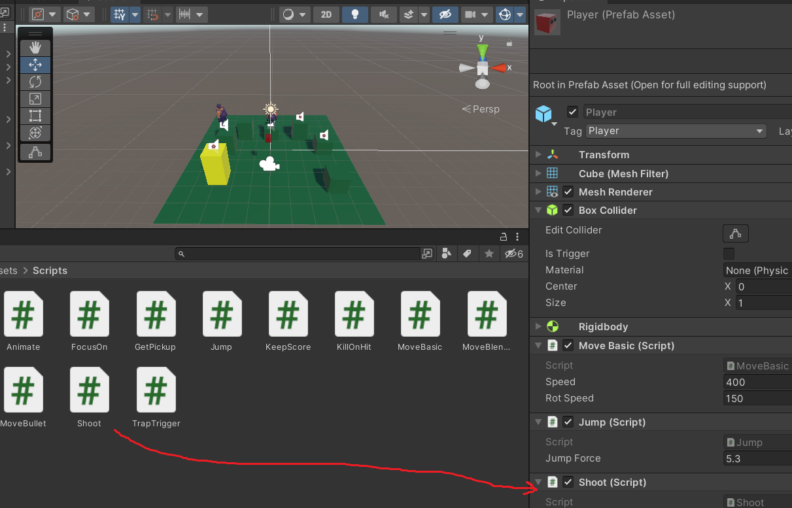

* Maak een public variabele aan waar je de **bullet prefab** in kunt opslaan

```
public GameObject prefab;
```

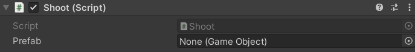

* Sleep je prefab er gelijk in in unity

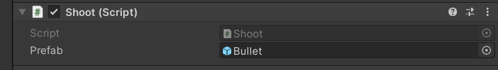

* Check nu in de **update()** methode of je een bepaalde toets indrukt

```
 if (Input.GetKeyDown(KeyCode.LeftControl)) {

 }
```

*Let op: voor het springen heb je de spatie waarschijnlijk al gebruikt!*

* gebruik de methode [**Instantiate()**](https://docs.unity3d.com/ScriptReference/Object.Instantiate.html) om je prefab als een object in de scene te zetten
* De **Instantiate()** methode geeft je het geplaatste gameobject terug, vang deze op in een variabele

```
    GameObject ob = Instantiate(prefab);
```

* geef het geplaatste gameObject (kogel) dezelfde positie als de speler

```
    ob.transform.position = transform.position;
```

* geef het geplaatste gameObject dezelfde rotatie als de speler

```
    ob.transform.rotation = transform.rotation;
```

* Zorg dat het geplaatste gameObject na een tijd vanzelf verdwijnt uit de scene met de [**Destroy()**](https://docs.unity3d.com/ScriptReference/Object.Destroy.html) Methode 

```
    Destroy(ob,3f);
```


### Tijd om verder te scripten: **MoveBullet.cs**

* Maak een **MoveBullet.cs** script en hang deze aan de prefab van je bullet

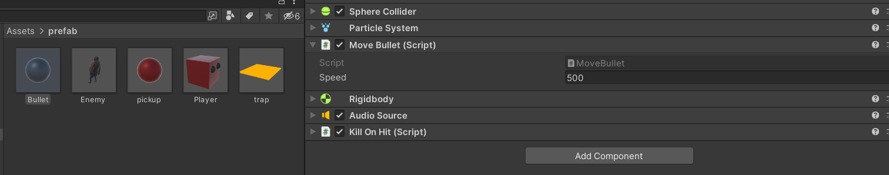

* Zorg voor een public varabele voor de **speed**

```
    public float speed = 500f;  
```

* Sla de **rigidboby** op in een variabele als de game **Start**

* Update de velocity van de bullet in de **[FixedUpdate](https://stackoverflow.com/questions/34447682/what-is-the-difference-between-update-fixedupdate-in-unity) Methode**

```
    void FixedUpdate()
    {
        rb.velocity = rb.transform.forward * speed * Time.fixedDeltaTime;
    }  
```

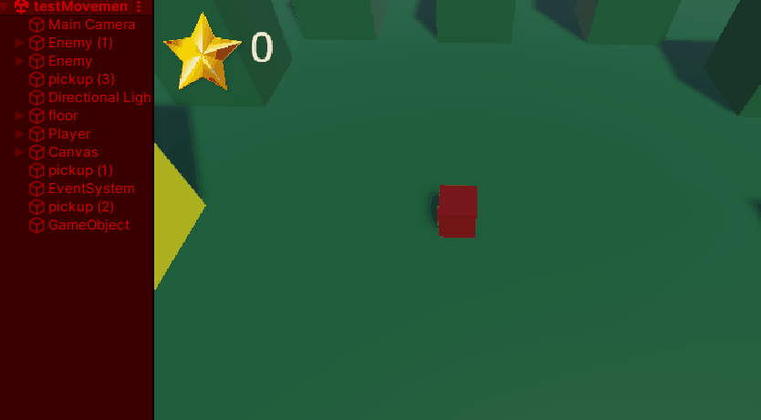

### Tijd voor een herbruikbaar script: **KillOnHit.cs** 

Dit script kunnen we (**her**)gebruiken om de **vijand** te laten exploderen als hij geraakt wordt door een **kogel** en de **speler** te laten exploderen als hij de **vijand** raakt. 


* Maak een nieuw script aan: **"KillOnHit.cs"**
* Hang het aan je **bullet** en **enemy** prefabs

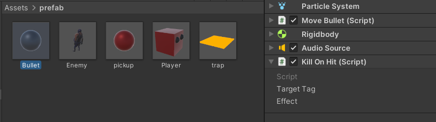

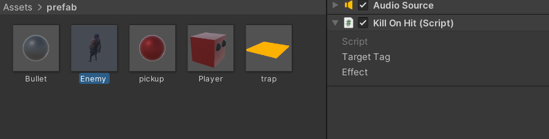
* Maak een **public** **string** waarin je de tag kunt invoeren van het type object dat moet exploderen

```
    public string targetTag;
```

* Maak een **public** **GameObject** waarin je de prefab van het explosie effect kunt toevoegen

```
    public GameObject effect;
```

* Voer als targetTag "Enemy" in bij de bullet 
* Sleep hier de explosion prefab in de **effect** variabele

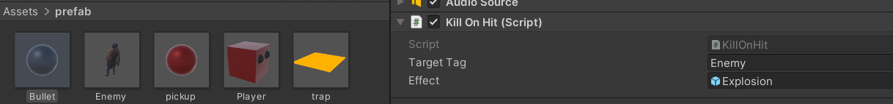

* Voer als targetTag "Player" in bij de enemy
* Sleep ook hier de explosion prefab in de **effect** variabele

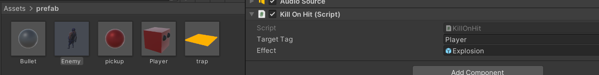

* Maak nu een variabele voor je audioSource en sla hierin bij de **Start** van je game de audioSource op 

```
 private AudioSource audioSource;    
 
 void Start()
 {
    audioSource = GetComponent<AudioSource>();
 }

```

* Roep beide methoden **OnCollisionEnter()** en **OnTriggerEnter()** aan

```
private void OnCollisionEnter(Collision coll)
{
        
}
private void OnTriggerEnter(Collider coll)
{
  
}    
```

* In beide methoden kun je dezelfde code schrijven!
* Het maakt hierdoor niet meer uit of een gameobject een collider of een trigger heeft
* Zorg dat je **kogel** een trigger heeft
* zorg dat je **enemy** een collider heeft

*Wat zou er gebeuren als je de enemy een trigger zou geven?*

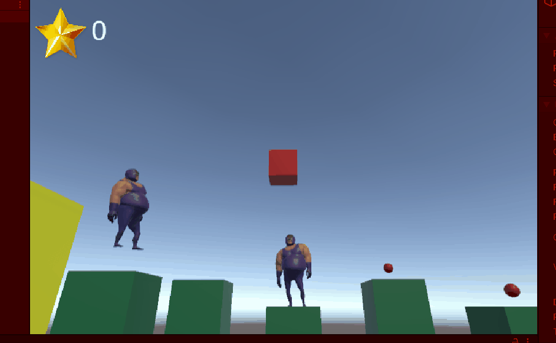

* Check in beide methoden (**OnCollisionEnter** en **OnTriggerEnter**) of de tag van het object overeenkomt met de meegegeven tag
```
    if (coll.gameObject.tag == targetTag){
    
    }
```

* Instantieer je explosie en sla het game object op in een variabele

```
        GameObject expl = Instantiate(effect);
```

* Haal je explosie weer weg na 2 seconden

```
        Destroy(expl,2f);
```

* Verwijder het **andere** gameobject waarmee een collision is geweest (**enemy** of **player**)

```
        Destroy(coll.gameObject, 0.1f);
```

* Speel het explosie geluid af!

```
        audioSource.Play();
```

* Test je game!
* Werkt het niet? Check of je tags goed zijn

### Bonus: Controleer de ingevoerde tag en geef zelf een error

Typ foutjes zijn zo gemaakt en als je in je **targetTag** een verkeerde tag schrijft die niet bestaat werkt je code niet.

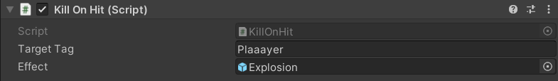


Je kunt te verwachten foutjes opvangen en daar jezelf of andere developers die met je code moeten werken voorzien van goede feedback met behulp van [Debug.LogError()](https://docs.unity3d.com/ScriptReference/Debug.LogError.html).

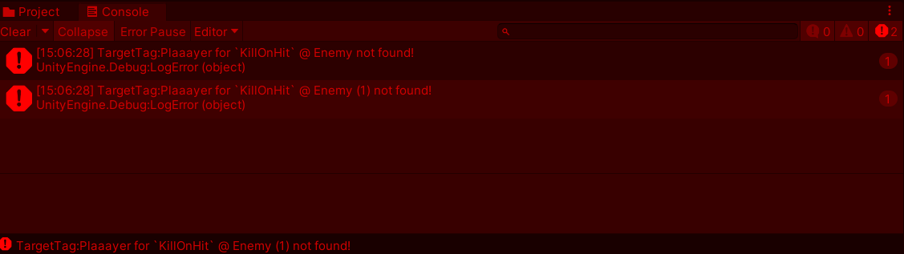

* Maak in de **Start** methode een boolean die bijhoud of je een bestaande tag hebt gevonden

```
    bool tagFound = false;
```

* Loop door de lijst van unity met gedefinieerde tags heen

```
    foreach (string tag in UnityEditorInternal.InternalEditorUtility.tags) {
    
    }
```

* Check of de via de inspector ingevoerde tag in de lijst zit en dus bestaat

```
        if (targetTag == tag) {
            tagFound = true;
            break;
        }
```

* Als na de loop de tag niet in de lijst is gevonden Log je een Error Message 

```
   if (!tagFound)
   {
        Debug.LogError("TargetTag:" + targetTag + " for `KillOnHit` @ " + gameObject.name + " not found!");
   }
```


### Commit en push je werk. Laat je Unity scene, je code en je repository zien aan de docent!