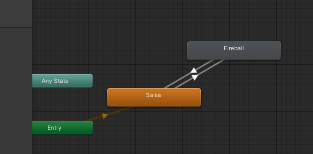
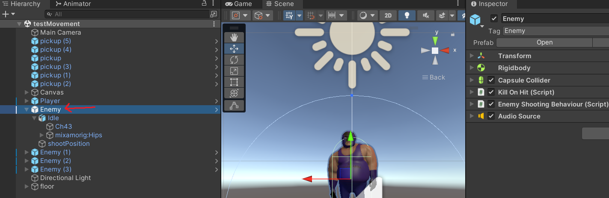
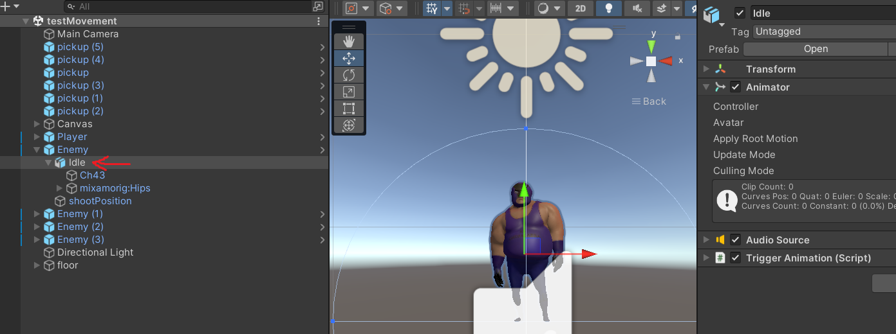
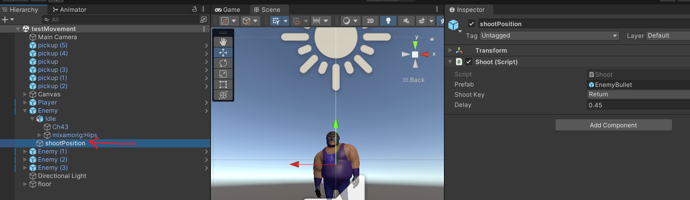
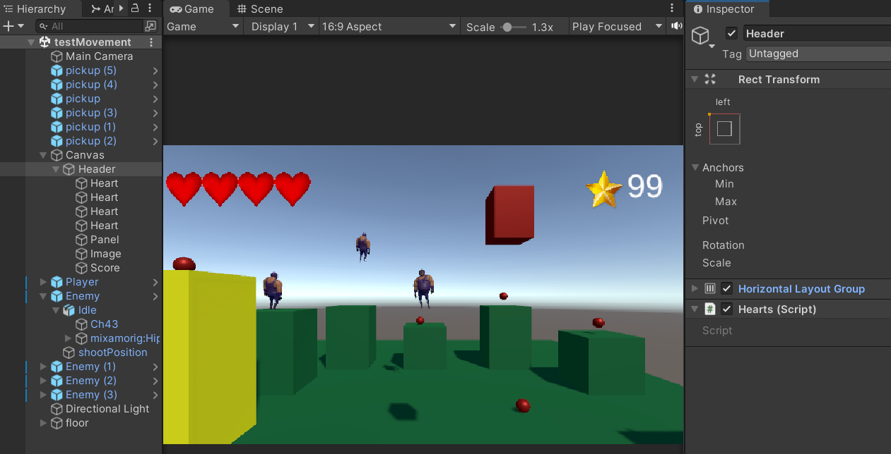
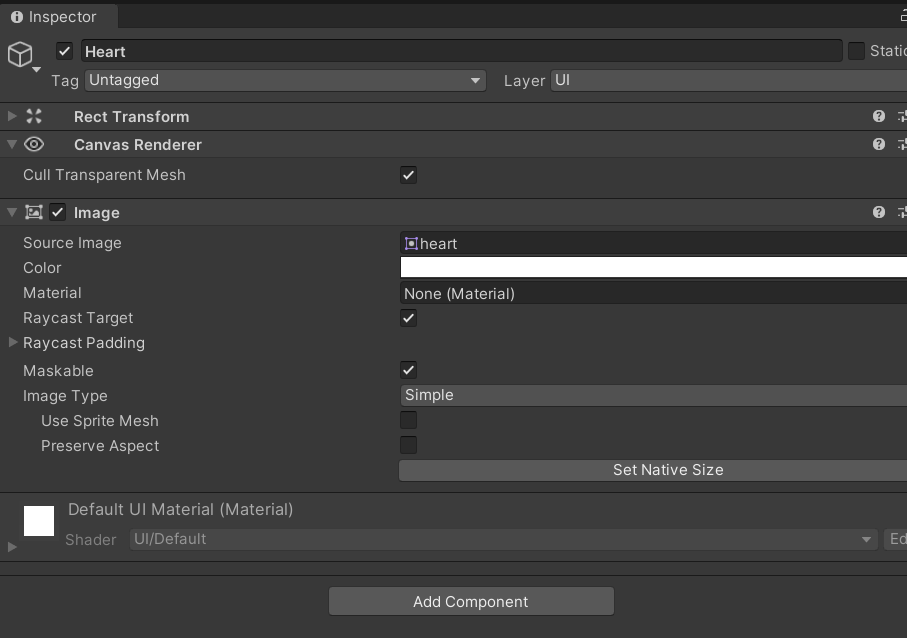
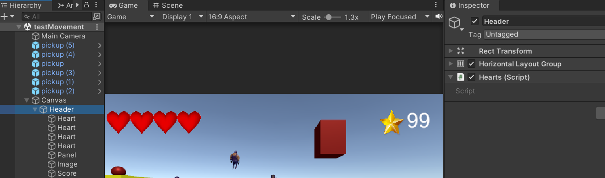
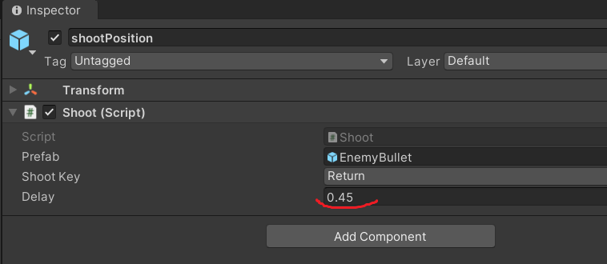

# SDM3PROG
**Les 6: Bijhouden van levens en creeren van vijanden**

## Leerdoelen:
* De student kan met behulp van coroutines stukken script uitstellen
* De student kan scripts zo veel mogelijk hergebruiken
* De student kan loops gebruiken met meerdere objecten hetzelfde gedrag te geven
* De student kan meerde items van hetzelfde type opvragen vanuit "children" van een gameobject 
* De student kan met timescale de game pauzeren 
* De student kan met lookAt zorgen dat objecten naar elkaar kijken
* De student kan met een simpel camerasysteem de speler volgen
* De student kan een getter en setter maken en gebruiken

## Planning:
* **5 min.** Hoe ver is iedereen gekomen? handen omhoog.
* **20 min.** Herhaling / uitleg over:
  * Coroutine
  * foreach loop
  * for loop
  * Hergebruik script voorbeeld (Shoot.cs op Player en op Enemy)
  * Getter en Setter (Hearts.cs aangeroepen in KillOnHit.cs)


* **60 min.** In 2 tallen werken aan de onderstaande opdracht
  * evt. wie wil klassiekaal de opdracht doornemen met de docent
* **15 min.** 3 groepjes laten zien hoe ver ze zijn gekomen en wat ze hebben gedaan
* **10 min.** Klassiekaal terugkijken: Wat ging goed en wat was/is lastig


## Opdracht:
Je hoeft deze opdracht alleen te doen als je 1 tm 6 al af hebt en een **excelente** beoordeling wilt krijgen.

Voer de onderstaande stappen uit en laat voor het einde van de les zien hoe ver je bent gekomen.

Als je klaar bent laat je het ook zien.

Als je vast zit vraag je om hulp!

### Deze les bouwen we schietende vijanden en houden we onze levens bij in de UI:


### Maak een nieuwe opzet voor je Enemy

* Zorg voor 2 animaties in je enemy (idle en attack)



* Zorg dat je het gameobject met de animator in een ander leeg game object (holder) zet




* Je Enemy holder bevat de volgende components:
  * Rigidbody
  * Capsule collider
  * Audio Source (explosion sound)
  * **KillOnHit.cs** Script
  * **EnemyShootingBehaviour.cs** Script (nog te maken!)

* Je gameobject met de animator bevat de volegden components:
  * Animator
  * Audio Source (Aanval Sound)
  * **TriggerAnimation.cs** Script (nog te maken)
  
* Je Enemy gameobject bevat ook een leeg gameobject voor het positioneren van nieuwe bullets (ShootPosition)



* Dit Gameobject bevat als component je **Shoot.cs** script (nog aan te passen)

* Zorg voor minimaal 1 enemy in je scene om te kunnen testen

* Zorg dat je van je enemy een prefab hebt gemaakt

### Pas je canvas aan



* Voeg een aantal Images toe met hartjes erin



* Je Header (Met de layout group) krijgt een nieuw script **Hearts.cs**




### Tijd om te scripten!

De volgende scripts komen er bij:
* **EnemyShootingBehaviour.cs**
* **TriggerAnimation.cs**
* **Hearts.cs**

Deze scripts worden aangepast:
* **Shoot.cs**
* **KillOnHit.cs**

#### **Shoot.cs** (aanpassen):
Dit Script zorgt ervoor dat een gameobject kan schieten. Tot nu toe hing hij op de Player maar we gaan zorgen dat ook de enemy er gebruik van kan maken.

* Zorg voor een public variabele **shootKey** van het Type **KeyCode**. Je kunt nu in de inspector een keycode kiezen waarmee je kunt schieten.

```
public KeyCode shootKey = KeyCode.LeftControl;

void Update()
{
    if (Input.GetKeyDown(shootKey)) {
        CallShot();                       
    }        
}
```

* We schrijven de methode **CallShot()**. Hierin maken we gebruik van een **coroutine** om te zorgen dat we het schot een delay kunnen geven. In dit geval moet eerste de aanval animatie klaar zijn.

```
public void CallShot()
{
    StartCoroutine(AwaitDelay(delay));
}
private IEnumerator AwaitDelay(float time) 
{      
    yield return new WaitForSeconds(time);
    createProjectile();
}
```

Met ```yield return new WaitForSeconds(time);``` wordt de uitvoer van de code tegengehouden totdat de tijd verstreken is. Pas daarna wordt **createProjectile()** aangeroepen.

* In de **createProjectile()** methode wordt daarwerkelijk de kogel aangemaakt zoals dat eerder in de **Update()** gebeurde. 
* Zorg ook voor een **public** variabele **delay** zodat je in de inspector kan aangeven hoe lang het moet duren voordat de kogel wordt geplaatst naar het aanroepen van het schieten. (ivm afmaken aanvalsanimatie) 



#### **TriggerAnimation.cs** (nieuw):
Dit script zorgt ervoor dat er animaties aangeroepen kunnen worden. In dit geval gebruiken wij dit voor de attack animatie van de enemy. 

Zorg voor een aantal **public** variabelen:
```
public string triggerName;
public float delay = 0f;
public float resetTime;
public KeyCode triggerKey = KeyCode.None;
```

* De variabele **triggerName** zorgt dat we het script kunnen hergebruiken voor meerdere animaties met andere trigger namen. In de inspector moet je de juiste trigger naam nu meegeven.

* De variabele **delay** zorgt ervoor dat de animatie niet gelijk afgespeeld hoeft te worden. Wij laten in dit geval de waarde gewoon op 0 staan waardoor er geen sprake van een delay is.

* De variabele **resetTime** zorgt ervoor dat de trigger weer gereset wordt na een bepaalde tijd. Dit om te voorkomen dat de trigger aan blijft staan en na een tijd weer opniew de animatie afspeelt.

* Met de variabele **triggerKey** kun je in de inspector een keycode kiezen om het script in gang te zetten.

* Zorg dat je zowel de **animator** als de **audiosource** components opslaat in variabelen voor later gebruik.

Vanuit de **Update()** methode roepen we een methode **CallTrigger()** aan als we op de geselecteerde knop drukken.
Deze Methode is **public** waardoor deze ook vanuit een ander script kan worden aangeroepen. Bijv. vanaf **EnemyShootingBehaviour.cs**

```
    void Update()
    {
        if (Input.GetKeyDown(triggerKey)) {
            CallTrigger();
        }        
    }
    public void CallTrigger()
    {
        StartCoroutine(AwaitDelay(delay));
        StartCoroutine(AwaitReset(resetTime));
    }
```

De **CallTrigger()** methode start 2 coroutines. **AwaitDelay()** en **AwaitReset()**. Deze zorgen voor het **starten** van de trigger en het **resetten** van de trigger als de delays voorbij zijn. 

```
    private IEnumerator AwaitDelay(float time) {
        yield return new WaitForSeconds(time);        
        animator.SetTrigger(triggerName);
        if(audioSource != null)audioSource.Play();
    }
    private IEnumerator AwaitReset(float time)
    {
        yield return new WaitForSeconds(time);
        animator.ResetTrigger(triggerName);
    }
```
Als er een audioSource aanwezig is wordt deze afgespeeld zodra de animatie wordt getriggered.


#### **KillOnHit.cs** (aanpassen):
Dit script zorgt ervoor dat gameobjecten kapot gemaakt kunnen worden door andere gameobjecten. Zoals Enemies door kogels en de player door de enemies. We gaan ervoor zorgen dat de player niet in 1x dood is als hij word geraakt maar dat er een leven afgaat.

```
    private void OnCollisionEnter(Collision coll)
    {
        handleHit(coll.gameObject);        
    }
    private void OnTriggerEnter(Collider coll)
    {
        handleHit(coll.gameObject);        
    }
    private void handleHit(GameObject other) {
        if (other.tag == targetTag)
        {
            GameObject expl = Instantiate(effect);
            expl.transform.position = other.transform.position;
            Destroy(expl, 2f);
            if (targetTag == "Player")
            {
                if (heartsScript == null)
                {
                    heartsScript = FindObjectOfType<Hearts>();
                }
                heartsScript.Lives--;
                if (heartsScript.Lives == 0)
                {
                    Destroy(other, 0.1f);
                }
            }
            else {
                Destroy(other, 0.1f);
            }
            if (audioSource != null)
            {
                audioSource.Play();
            }
        }
    }
```
We controleren zowel de **OnCollisionEnter()** als de **OnTriggerEnter()** methodes en roepen vandaaruit de **handleHit()** methode aan. 
Als de tag van het geraakte object overeenkomt met de gekozen tag plaatsen we een explosie.
Er wordt nu gecheckt of het geraakte gameobject de **"Player"** is. Is dit zo is halen we 1 malig het script binnen om de levens in de UI bij te houden (**Hearts.cs**)
We halen er vervolgens 1 leven vanaf via in het **Hearts** script. 
We controleren de resterende levens en als deze op zijn dan vernietigen we de speler.

Als het geraakte game object niet de "Player" was dan doen we bovenstaande stappen niet en vernietigen we het object gelijk.

Tot slot checken we of er een audioSource is en spelen we deze dan af.

#### **EnemyShootingBehaviour.cs** (nieuw):
Dit script zorgt ervoor dat er instelbare voorwaarden (range en cooldown) komen waaronder de enemy de schiet functie uit te schietscript aanroept. Ook zorgt dit script ervoor dat de enemy een target heeft om te volgen en om op te schieten. 


Om te beginnen hebben we 2 andere scripts nodig:Shoot en TriggerAnimation.
```
    void Start()
    {
        shootScript = GetComponentInChildren<Shoot>();
        triggerAnimationScript= GetComponentInChildren<TriggerAnimation>();
    }

```
Uit beide scripts willen we methoden aanroepen. **CallShot()** in **Shoot.cs** en **CallTrigger()** in **TriggerAnimation.cs**

In de **Update()** methode zorgen we ervoor dat de enemies constant onze kant op kijken.
Door op de y-as de positie van de enemy zelf te gebruiken zullen ze nooit omhoog of omlaag gaan kijken.

```
 Vector3 targetPos = new Vector3(target.position.x, transform.position.y, target.position.z);
 transform.LookAt(targetPos);
```

Als we in **ShotRange** komen moeten ze schieten.

Eerst slaan we het verschil tussen de enemy en player posities op.
Als de totale waarde op alle assen (magnitude) onder de range waarde komt dan checken we ook nog even op een cooldown.
Als er geen cooldown actief is en de speler is in range wordt er via het **Shoot.cs** script geschoten met de methode **CallShot()**
Ook wordt er dan via het script **TriggerAnimation.cs** een aanvals animatie aangeroepen met de methode **CallTrigger()**
De cooldown gaat nu aan waardoor de enemy niet meer kan schieten.
En er start een coroutine die de cooldown weer uitzet na de ingestelde tijd.

```
 Vector3 delta = transform.position - target.position;

 if (delta.magnitude < shotRange && !inCooldown) 
 { 
    shootScript.CallShot();
    triggerAnimationScript.CallTrigger();
    inCooldown= true;
    StartCoroutine(Cooldown(coolDownTime));
 }

```


#### Hearts.cs (nieuw):
Dit script zorgt ervoor dat de hartjes in de UI aan en uitgezet worden als je levens worden aangepast

In de Start methode gaan we voor alle images in de UI de naam controleren. We willen tellen (met count) hoeveel hartjes er zijn.

```
        Image[] images = GetComponentsInChildren<Image>();       
        int count = 0;
        foreach (Image img in images)
        {
            if (img.name == "Heart") {
                count++;
            }
        }
```

Nu maken we een array aan waarin we alle hartjes opslaan. We hergebruiken count om de hartjes op je juiste plek (index) in de array te zetten.
Als je niet meer helemaal begrijpt hoe arrays werken [**check dat dan hier**](https://www.w3schools.com/cs/cs_arrays.php)
```
        hearts= new Image[count];
        count= 0;
        foreach (Image img in images)
        {
            if (img.name == "Heart")
            {
                hearts[count] = img;
                count++;
            }
        }
```

Tot slot geven we het aantal hartjes mee als waarde voor het aantal levens dat we hebben. 
De **lives** variabele zal worden aangepast tijdens de game.
**maxLives** niet en kan worden gebruikt om te checken hoe veel levens je eventueel nog terug zou kunnen krijgen.

```
        lives = hearts.Length;
        maxLives = hearts.Length;
```

Met C# kun je zogenaamde **Getters** en **Setters** maken dit zijn eigenlijk methoden die je kunt gebruiken als eigenschappen (public variables)
[Hier kun je meer vinden over getters en setters](https://www.w3schools.com/cs/cs_properties.php).

Met de onderstaande code kun je de waarde van de variabele *lives* ophalen en opslaan vanuit een ander script via een public **Lives** "variabele" (is eigenlijk een public method).
Echter kun je bij het ophalen (get) en wegschrijven (set) ook nog code toevoegen om extra dingen te doen.

Bij het wegschrijven (set) controleer ik of de nieuwe waarde niet over het maximun gaat en niet onder nul komt.
Ik sla dan de waarde op in de variabele **lives**.

Ik loop nu door de lijst met hartjes heen die tijdens het starten heb opgeslagen.
Als het index nummer van het hartje(image) **i** minder is dan het aantal levens word het hartje weergegeven.
Zo niet wordt het hartje onzichtbaar gemaakt.

Als je levens op zijn wordt de game stilgezet. 

```
    public int Lives{
        get { return lives; }
        set {
            if (value <= maxLives && value >= 0)
            {
                lives = value;
                for (int i = 0; i < hearts.Length; i++)
                {
                    if (i < lives)
                    {
                        hearts[i].enabled = true;
                    }
                    else
                    {
                        hearts[i].enabled = false;
                    }
                }
                if(lives == 0)pauseGame();
            }
            
        }
    }

```

#### Probeer als je dat nog niet hebt gedaan ook een systeem te maken om de camera je speler te laten volgen.

Let op! Niet alle noodzakelijke code is nu letterlijk gedeeld je zult zelf nog bepaalde dingen moeten toevoegen zoals sommige variabelen declareren en errors oplossen.

Ook zal je waarschijnlijk in de inspector goed moeten checken of alle variabelen een noodzakelijke waarde hebben of een referentie naar andere gameobjecten.


* Test je game!


### Commit en push je werk. Laat je Unity scene, je code en je repository zien aan de docent!

